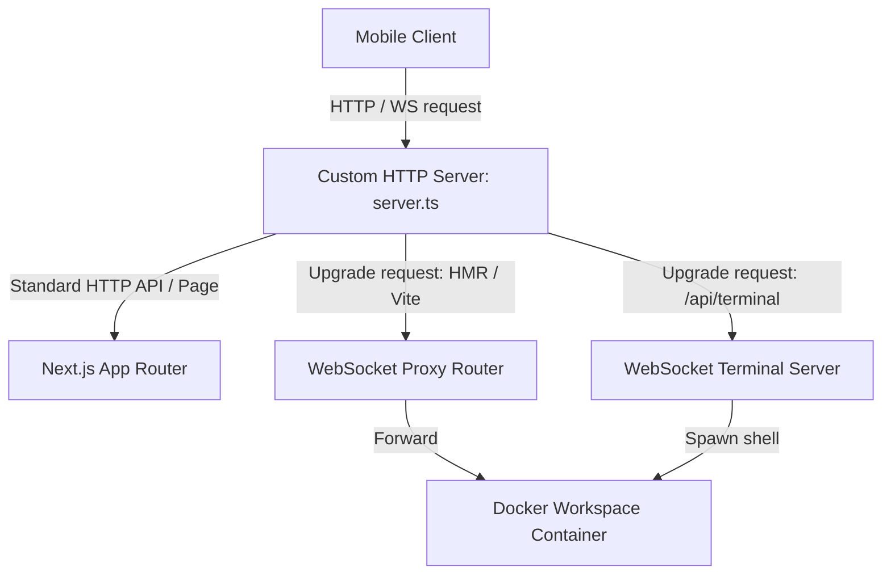
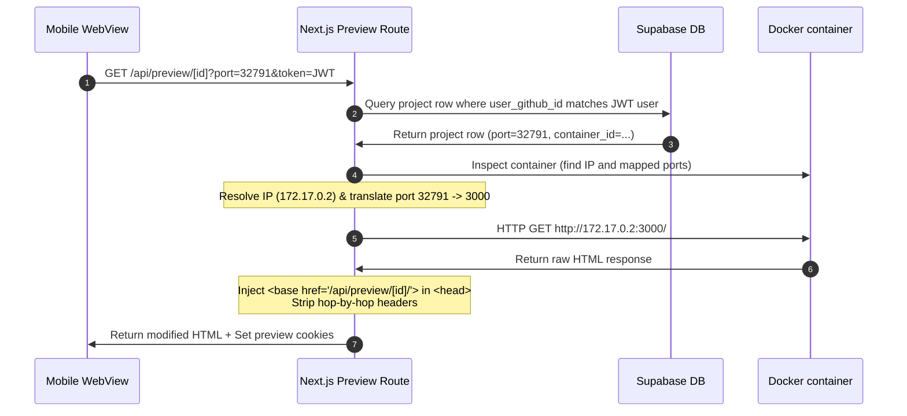
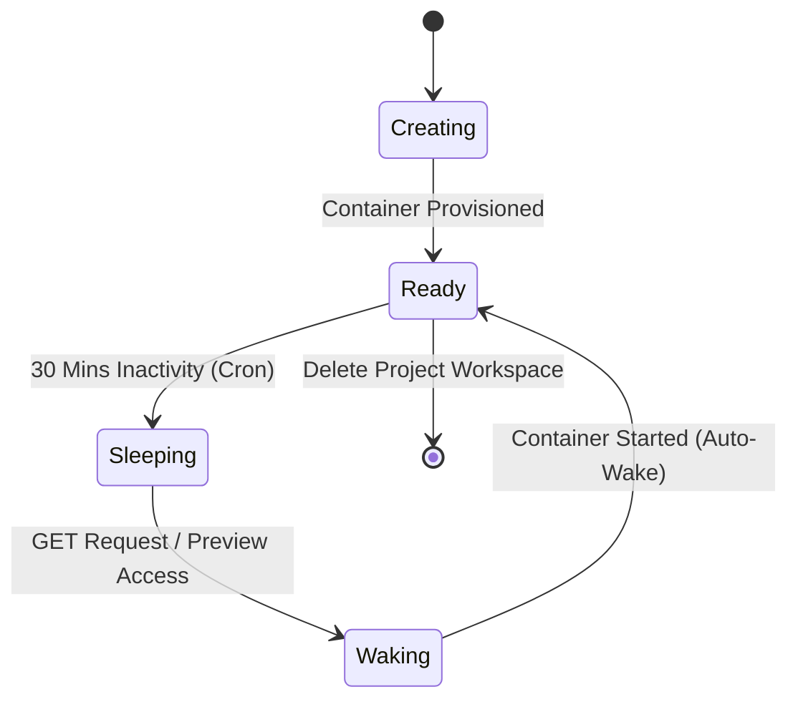

# CloudCode — Universal Cloud Development Environment (CDE)

CloudCode is a next-generation Cloud Development Environment (CDE) platform that allows developers to spin up, edit, build, run, and preview full-stack applications directly from a mobile client. The architecture replicates a native PC development experience by running isolated Docker containers on a Virtual Private Server (VPS) and proxying HTTP/WebSocket traffic dynamically to the client.

This document serves as the **master architectural handbook (A to Z)** for the entire CloudCode codebase.

---

## 📂 Repository Directory Map

```text
cloudcode/
├── .github/
│   └── workflows/
│       └── deploy.yml          # GitHub Actions deploy runner (targets VPS backend)
├── backend/                    # Next.js 16 Custom Server API & Preview Proxy
│   ├── src/
│   │   ├── app/                # Next.js App Router (HTTP Endpoint Handlers)
│   │   │   ├── api/
│   │   │   │   ├── ai/         # AI Prompt handler placeholders
│   │   │   │   ├── auth/       # GitHub OAuth Callback & Handlers
│   │   │   │   ├── preview/    # Dynamic preview reverse-proxy catch-all routes
│   │   │   │   ├── projects/   # Workspace CRUD & Git Import APIs
│   │   │   │   └── user/       # User profiles & general SSH Key endpoints
│   │   ├── lib/                # Core helper scripts & abstractions
│   │   │   ├── activityTracker.ts  # In-memory user idle state manager
│   │   │   ├── auth.ts         # Supabase JWT verify & Auth middleware
│   │   │   ├── docker.ts       # Dockerode socket connector & state controls
│   │   │   ├── git.ts          # Git commands wrapper executed in containers
│   │   │   ├── supabase.ts     # Supabase DB admin client config
│   │   │   ├── terminal.ts     # node-pty shell process streams bridge
│   │   │   └── types.ts
│   │   └── server.ts           # Next.js wrapping HTTP & WebSocket Custom Server
│   ├── package.json
│   └── tsconfig.json
├── mobile/                     # React Native / Expo Mobile Client Application
│   ├── app/
│   │   ├── (tabs)/             # Bottom-tab navigator screens
│   │   │   ├── ai.tsx          # AI Assistant interactive prompt view
│   │   │   ├── dashboard.tsx   # Statistics, shortcuts, activity feed
│   │   │   ├── projects.tsx    # List grid of user projects with controls
│   │   │   └── settings.tsx    # Custom preferences & settings
│   │   ├── project/[id]/       # Workspace-specific editor routes
│   │   │   ├── editor.tsx      # Multi-file code editor screen
│   │   │   └── index.tsx       # Live terminal and file explorer portal
│   │   ├── auth.tsx            # Login overlay
│   │   ├── index.tsx           # Session router gate
│   │   └── new-project.tsx     # Wizard to create from templates or GitHub
│   ├── components/             # Reusable UI components
│   ├── store/                  # Zustand global application state
│   └── package.json
└── README.md                   # This Handbook (Master Documentation)
```

---

## 🗺️ Master End-to-End Sequence Diagram (Visual Blueprint)

The sequence diagram below provides the master architectural blueprint of CloudCode, mapping how the mobile client, Next.js custom server, Supabase DB, host filesystem, and Docker daemon collaborate across all runtime operations.

```mermaid
sequenceDiagram
    autonumber
    actor Developer as Mobile Client (Expo App)
    participant Server as Next.js Custom Server (Host VPS)
    participant DB as Supabase DB
    participant HostFS as Host Filesystem
    participant Docker as Docker Daemon
    participant Container as Isolated Container (non-root coder)
    
    %% Section 1: Auth & Bootstrap
    Note over Developer, DB: 1. Authentication & Boot
    Developer->>Server: HTTP GET /api/auth/github (or JWT verify)
    Server->>DB: Query User Profile & RLS validation
    DB-->>Server: User authenticated (JWT verified)
    Server-->>Developer: Return JWT Session Token
    
    %% Section 2: Workspace Creation
    Note over Developer, Container: 2. Workspace Provisioning & Git Import
    Developer->>Server: HTTP POST /api/projects/import (name, githubUrl)
    Server->>DB: Insert project metadata (status: 'creating')
    Server->>HostFS: spawnSync('git', ['clone', '--depth=1', githubUrl, workspacePath]) [SSRF / shell-safe]
    Server->>HostFS: chmod -R 777 (grant read/write to coder user)
    Server->>Docker: createContainer() (CPU: 512, RAM: 1GB, bind workspace & SSH keys volume)
    Docker->>Container: Start container process (Running Node/Bash)
    Docker-->>Server: Return Container ID & Host-mapped port
    Server->>DB: Update project metadata (status: 'ready', container_id, port)
    Server-->>Developer: Return Project Info (Ready)
    
    %% Section 3: Editing & Persistent Terminal
    Note over Developer, Container: 3. Editing & Persistent Terminal Loop
    Developer->>Server: WebSocket /api/terminal/[projectId]?token=JWT
    Server->>DB: Verify Ownership & container status
    Server->>Docker: container.exec(['/bin/bash'])
    Server-->>Developer: WebSocket JSON: { type: "ready", message: "username@cloudcode" }
    Developer<->Server: Bi-directional Stdin/Stdout packets (persistent via tmux wrapper)
    Developer->>Server: HTTP GET /api/projects/[id]/files (read files using resolved paths)
    Server->>HostFS: path.resolve() & read directory [Path Traversal guarded]
    HostFS-->>Server: Return folder contents
    Server-->>Developer: Return File Tree data
    
    %% Section 4: App Running & Preview Proxy
    Note over Developer, Container: 4. Build, Run & Preview Proxy
    Developer->>Server: WS: Injects compile/run command (e.g. gcc/python3) to active terminal
    Server->>Container: Execute command in bash stdin
    Container->>Container: App boots & binds to internal port (e.g., 3000)
    Developer->>Server: WebView HTTP GET /api/preview/[id]?port=3000 (with cookies)
    Server->>Docker: Inspect container (Get internal IP: 172.17.0.2)
    Server->>Container: check local listener & bind TCP forwarder if loopback
    Server->>Container: HTTP Fetch to http://172.17.0.2:3000/
    Container-->>Server: Return raw HTML response
    Note over Server: Inject <base href="/api/preview/[id]/"> & rewrite CSS urls
    Server-->>Developer: Set Cookies (preview_token, preview_port) + Return rewritten HTML
    
    %% Section 5: Cron Auto-Sleep & Auto-Wake
    Note over Developer, Container: 5. Cron Auto-Sleep & Auto-Wake
    Note over Server: Cron runs every 5 mins. If project activity idle > 30 mins:
    Server->>Docker: Stop Container (docker stop)
    Server->>DB: Update status: 'sleeping'
    Developer->>Server: Subsequent request to Preview or Files API
    Server->>Docker: Start Container (docker start)
    Server->>DB: Update status: 'ready' & new port mappings
    Server-->>Developer: Return Waking Up Loading Page -> Redirect once ready
```

---

## ⚙️ Core Architectural Subsystems

### 1. Custom HTTP & WebSocket Server
The backend runs on a custom server configured in [server.ts](file:///c:/Users/pathu/OneDrive/Desktop/cloudcode/backend/src/server.ts). Rather than using the default `next start` server, this custom setup runs an HTTP server using Node's native `http` module and boots the Next.js application as middleware.



Key features of this server include:
* **WebSocket Interception:** Listens for `upgrade` requests on the server port. Requests matching `/api/terminal/*` are routed directly to the terminal WebSocket handler.
* **WebSocket Reverse Proxying:** Listens for Hot Module Replacement (HMR) and Vite live-reload WebSocket requests (`/_next/webpack-hmr`, `/__vite`, `/ws`, `/ws?*`) and proxies them directly to the corresponding active container on the Docker bridge network.
* **Statelessness:** Stores no state in memory, allowing it to boot instantly and handle high volumes of concurrent HTTP and WebSocket requests.

---

### 2. Interactive Terminal Shell System
Real-time console interaction is managed through a bridge between the client terminal view, Node WebSockets, and Docker commands.

* **Client Setup:** [app/project/[id]/index.tsx](file:///c:/Users/pathu/OneDrive/Desktop/cloudcode/mobile/app/project/%5Bid%5D/index.tsx) initiates a connection to `ws://<backend-url>/api/terminal/[projectId]?token=<jwt>&terminalId=<id>`.
* **Verification & Handshake:** The server authorizes the token using Supabase keys, verifies project ownership, and inspects the database to ensure the corresponding container is running.
* **Container Exec Spawn:** The server calls `dockerode.exec` to launch `/bin/sh` or connect to a `tmux` session inside the container:
  ```typescript
  Cmd: ['/bin/sh', '-c', 'if command -v tmux >/dev/null 2>&1; then exec tmux new-session -A -s "cloudcode-..."; else exec /bin/sh; fi']
  ```
* **Interactive Stream Bridge:** The input/output streams of the exec process are multiplexed over the WebSocket connection.
* **Packet Protocol:** Messages exchanged via WebSocket are structured JSON frames:
  - **Input (Client -> Server):** `{ "type": "input", "data": "ls -la\n" }`
  - **Resize (Client -> Server):** `{ "type": "resize", "cols": 80, "rows": 24 }` (calls `exec.resize` to redraw terminal output correctly).
  - **Output (Server -> Client):** `{ "type": "output", "data": "..." }`
  - **Ready (Server -> Client):** `{ "type": "ready", "message": "..." }`

```mermaid
sequenceDiagram
    autonumber
    participant Client as Mobile Client
    participant Server as Next.js Custom Server
    participant Container as Docker Container
    
    Client->>Server: Connect WS (ws://.../api/terminal/[id]?token=JWT)
    Note over Server: Verify JWT & inspect owner in Supabase
    Server->>Container: Spawn Docker Exec (/bin/sh or tmux session)
    Server->>Client: Send JSON message: { type: "ready" }
    
    rect rgb(30, 30, 40)
        Note over Client, Container: Interactive Loop
        Client->>Server: Send JSON keystroke: { type: "input", data: "npm run dev\n" }
        Server->>Container: Write raw bytes to container Stdin
        Container->>Server: Stream stdout response
        Server->>Client: Send JSON output: { type: "output", data: "..." }
    end
    
    Client->>Server: Send JSON resize event: { type: "resize", cols: 100, rows: 30 }
    Server->>Container: Resize virtual TTY rows/cols
```



---

### 3. Dynamic Preview Proxy Layer
When a user launches a web app (e.g. Vite, React, Express) inside their container, the application listens on an internal port (e.g. `3000` or `5173`). The preview proxy maps these internal ports to clean, authenticated preview endpoints.

* **Target Resolution ([resolveTarget](file:///c:/Users/pathu/OneDrive/Desktop/cloudcode/backend/src/app/api/preview/%5Bid%5D/%5B%5B...path%5D%5D/route.ts#L14)):** Inspects the container configuration via `dockerode.inspect()` to get its internal IP address on the Docker bridge network (e.g. `172.17.0.2`). It iterates through container port bindings to resolve host-mapped ports back to their internal values.
* **HTTP Reverse Proxying:** Sends requests to `http://<container-ip>:<internal-port>/<sub-path>` using Node `fetch` with manual redirect handling and a `120s` timeout for compilation tasks.
* **Header & Cookie Management:**
  - Injects `Host` header overrides matching the container's virtual target (`localhost:<internal-port>`).
  - Sets cookies (`preview_project_id`, `preview_token`, `preview_port`) on initial load to ensure subsequent resource loads (which may not contain URL parameters) are authenticated and routed correctly.
* **HTML Base Tag Injection:** Modifies HTML responses to inject a `<base>` tag in the `<head>` block:
  ```html
  <base href="/api/preview/[projectId]/">
  ```
  This forces the client browser to resolve all relative assets (images, stylesheets, scripts) through the authenticated proxy route automatically, avoiding bundle corruption.
* **CSS URL Rewriting:** Parses CSS stylesheets and prepends the proxy path to all `url(/...)` references to route background assets correctly.
* **Smart Proxy Fallback:** If the requested port is not found in the container's active host bindings (e.g. if the database record is stale), the proxy checks if the port is a standard internal port (e.g. `3000`, `5173`). If it's a non-standard port, it falls back to internal port `3000` and logs a warning instead of failing.



---

### 4. Activity Tracker & Auto-Sleep/Auto-Wake Engine
To keep VPS costs low and conserve resources:

* **In-Memory Store ([activityTracker.ts](file:///c:/Users/pathu/OneDrive/Desktop/cloudcode/backend/src/lib/activityTracker.ts)):** Manages a map tracking project activity timestamps.
* **Activity Hooks:** Updates the project's timestamp whenever:
  - An HTTP API call loads project details.
  - A file is opened, modified, or saved.
  - A WebSocket connection is opened or terminal input is received.
  - A request is handled by the preview proxy.
* **The Auto-Sleep Cron:** A `setInterval` job in `server.ts` runs every 5 minutes:
  1. Queries all projects marked as `'ready'` in the database.
  2. Compares the current time with the last active timestamp in the tracker.
  3. If a project has been idle for more than 30 minutes, it stops the container (`docker stop`) and updates the project status in the database to `'sleeping'`.
* **The Auto-Wake Middleware:** When a user visits their workspace or accesses the preview, the server calls `ensureContainerRunning()`. If the container is sleeping, it:
  1. Wakes the container up (`docker start`).
  2. Updates its status in the database to `'ready'`.
  3. Updates the `port` column in the database with its new public port.
  4. Returns a styled `"Waking up..."` loading page to the client, redirecting them once the container is ready.



---

### 5. Workspace Templates & Git Import System
Workspaces are initialized using one of two methods:

* **From Local Template:**
  - Creates a workspace folder inside `projects/[id]/`.
  - Seeds configuration files depending on the selected type:
    - **`node`:** Sets up a basic HTTP server in `index.js` and a `package.json` with startup scripts.
    - **`react`:** Seeds a Vite React template, setting up standard dependency configurations and dev scripts.
    - **`empty`:** Seeds a simple `README.md` file.
  - Sets file permissions recursively to full read-write (`chmod -R 777`) so they can be modified by the container.
* **From GitHub Import:**
  - Clones the target git repository into the project directory:
    ```bash
    git clone --depth=1 "<github-url>" "projects/<id>"
    ```
  - Applies file permissions (`chmod -R 777`).
  - Boots the container and runs Git configurations to trust the directory boundaries.

---

### 6. Git HTTP API Integration
The backend exposes API endpoints under `api/projects/[id]/git/` to manage Git repositories within workspace containers:
* **SSH Key Management:** Mounts a unique volume (`cloudcode-ssh-<userId>`) to `/home/coder/.ssh` inside the container, keeping users' SSH keys isolated.
* **Git Operations:** Endpoints run commands inside the container using the container's exec stream:
  - **`status`**: Runs `git status` and parses tracked/untracked changes.
  - **`stage`**: Runs `git add <file>`.
  - **`commit`**: Runs `git commit -m "<message>"`.
  - **`branches`**: Runs `git branch` (to list) or `git checkout -b <branch>` (to switch).
  - **`diff`**: Runs `git diff` to view staging changes.
  - **`sync`**: Runs `git push` or `git pull` using configured credentials.

---

## 💾 Database Entity Model (Supabase PostgreSQL)

The database schema is managed in **Supabase** and utilizes PostgreSQL. Below is the structure of the `projects` table:

```sql
CREATE TABLE projects (
  id UUID PRIMARY KEY DEFAULT gen_random_uuid(),
  name VARCHAR(60) NOT NULL,
  type VARCHAR(20) NOT NULL CHECK (type IN ('node', 'react', 'empty')),
  status VARCHAR(20) NOT NULL CHECK (status IN ('creating', 'ready', 'sleeping', 'error')),
  container_id VARCHAR(255) NULL,
  port INTEGER NULL,                  -- Holds the public host-mapped port for internal port 3000
  github_url TEXT NULL,               -- Stores clone URL if imported
  user_github_id VARCHAR(100) NOT NULL,
  created_at TIMESTAMP WITH TIME ZONE DEFAULT timezone('utc'::text, now()) NOT NULL
);
```

### Security Policies (RLS)
The database enforces **Row Level Security** on all tables. A user can only access or modify project rows that belong to their validated GitHub ID:
```sql
ALTER TABLE projects ENABLE ROW LEVEL SECURITY;

CREATE POLICY "Users can manage their own projects"
ON projects FOR ALL
TO authenticated
USING (auth.uid() = user_github_id);
```

---

## 📱 Mobile Screen Registry & Navigation Map

The mobile application is built using **React Native** and **Expo**, utilizing `expo-router` for file-based routing and `zustand` for state management:

1. **Authentication Guard (`app/index.tsx`)**: Decides if a user needs to login or redirects to the dashboard.
2. **Login View (`app/auth.tsx`)**: Handles credentials and OAuth logins.
3. **App Tabs (`app/(tabs)/_layout.tsx`)**: Bottom navigation bar.
   * **Dashboard (`(tabs)/dashboard.tsx`):** Displays platform statistics (active containers, memory usage, uptime) and recent workspaces.
   * **Workspaces Grid (`(tabs)/projects.tsx`):** Grid list of user projects showing container states (`creating`, `sleeping`, `ready`) with controls to start or stop containers.
   * **AI Assistant (`(tabs)/ai.tsx`):** Interactive prompt screen for code generation, bug fixing, and terminal management.
   * **Settings (`(tabs)/settings.tsx`):** Profile preferences and connection details.
4. **Workspace Detail Manager (`app/project/[id]/index.tsx`)**: A tabbed view containing:
   * **Terminal Console (`TerminalTab`):** A virtual terminal emulator that connects to the container's shell stream.
   * **File Tree (`FilesTab`):** A sidebar navigation layout to view, add, or delete project files.
   * **Git Control (`GitTab`):** Staging, committing, and syncing tools.
   * **Live App Preview (`PreviewTab`):** Web viewport to preview running apps.
5. **Code Editor (`app/project/[id]/editor.tsx`)**: Fullscreen text editor with auto-save capabilities that sync modifications back to the container.

---

## 🩹 Recent Critical Fixes

### 1. GitHub Actions Trigger Optimization
* **Issue:** Pushes to the `mobile` folder were triggering the backend deployment runner, causing unnecessary builds on the VPS.
* **Fix:** Configured `paths` rules in [.github/workflows/deploy.yml](file:///c:/Users/pathu/OneDrive/Desktop/cloudcode/.github/workflows/deploy.yml). The workflow now only triggers when changes are made inside `backend/` or `.github/workflows/`. If a push modifies both frontend and backend code, the backend deployment still runs correctly.

### 2. Next.js Production Startup Crash
* **Issue:** Next.js was crashing on startup on the VPS, throwing `ENOENT: no such file or directory, open '/root/cloudcode/backend/.next/dev/required-server-files.json'`.
* **Cause 1:** PM2 was running the backend start command without the `NODE_ENV=production` environment variable set. Next.js fell back to development mode and looked for development files inside the production build folder.
* **Cause 2:** In [server.ts](file:///c:/Users/pathu/OneDrive/Desktop/cloudcode/backend/src/server.ts), `loadEnvConfig()` was called *after* checking `process.env.NODE_ENV !== 'production'`. Because of this, variables from `.env` files were not loaded in time to initialize Next.js in production mode.
* **Fix:**
  - Moved `loadEnvConfig()` to the very top of [server.ts](file:///c:/Users/pathu/OneDrive/Desktop/cloudcode/backend/src/server.ts) to ensure environment files load first.
  - Prepended `"start": "NODE_ENV=production tsx src/server.ts"` to [package.json](file:///c:/Users/pathu/OneDrive/Desktop/cloudcode/backend/package.json).
  - Ran PM2 update commands with `--update-env` to clear cached development variables.

### 3. Stale Preview Port Resolution & Address Bar Translation
* **Issue:** Connecting to a project preview failed with `connect ECONNREFUSED 172.17.0.2:<old_port>`.
* **Cause:** When a container was recreated (due to self-healing or Docker host pruning), it received a new random host-mapped port, but the database port column remained unchanged. The client requested the old stale port, which the proxy target resolver failed to resolve.
* **Fix:**
  - Modified [docker.ts](file:///c:/Users/pathu/OneDrive/Desktop/cloudcode/backend/src/lib/docker.ts) to update the `port` column in the database whenever a container is recreated.
  - Modified [route.ts](file:///c:/Users/pathu/OneDrive/Desktop/cloudcode/backend/src/app/api/projects/%5Bid%5D/route.ts) (project details) to prioritize the container's active host-mapped port over the stored database value when the container is running.
  - Modified [route.ts](file:///c:/Users/pathu/OneDrive/Desktop/cloudcode/backend/src/app/api/preview/%5Bid%5D/%5B%5B...path%5D%5D/route.ts) (preview proxy) to fall back to the default internal port `3000` if the requested port does not match any active container host bindings and is not a standard internal port.
  - Modified [PreviewTab.tsx](file:///c:/Users/pathu/OneDrive/Desktop/cloudcode/mobile/components/project/PreviewTab.tsx) to resolve active ports back to clean, virtual internal port mappings (like `http://localhost:3000/` or `http://localhost:5173/`) for the address bar, keeping the public ports hidden.
  - Added logic to [PreviewTab.tsx](file:///c:/Users/pathu/OneDrive/Desktop/cloudcode/mobile/components/project/PreviewTab.tsx) to hide the URL in the address bar initially and when a loading error occurs, showing a clean "No active server" placeholder until the page loads successfully.

---

## 📈 Cost & Concurrency Model (At 5K Users)

### Resource Limits Per Plan
* **Free (Ad-Supported):** 512MB RAM container, 256 CPU shares, 1 active workspace, 10 min idle sleep timeout, no custom domain.
* **Pro ($29/mo):** 2GB RAM container, 1024 CPU shares, 10 workspaces, 2-hour idle sleep timeout, custom domains.
* **Enterprise ($99/mo):** 4GB RAM container, 2048 CPU shares, unlimited workspaces, 6-hour idle sleep timeout, always-on container (1 project).

### Concurrency Projections
For 5,000 registered users, we project:
* **Daily Active Users (DAU):** ~500–750 (10–15%).
* **Peak Concurrent Active Sessions:** ~75–120.
* **Average active containers running simultaneously:** ~60–75 (thanks to the 30-minute auto-sleep feature).
* **Peak memory footprint on the cluster:** ~128–160 GB RAM (including host OS overhead).

### Profit & Loss Breakdown (5,000 Users)
* **Estimated Monthly Revenue:** ~$46,500
* **Infrastructure Costs (DigitalOcean worker swarm, load balancer, storage):** ~$1,100/mo
* **Database (Supabase Pro) + API usage (Gemini API):** ~$250/mo
* **Total Operating Costs:** ~$1,350/mo
* **Gross Profit:** **~$45,150/mo (97% Margin)**

---

## 🚀 Scalability Evolution Roadmap

### Phase 1: Current Setup (Single Droplet)
All backend APIs, preview proxies, and developer containers run on a single DigitalOcean Droplet (4GB). Storage is hosted locally. Cost: ~$24/mo.

### Phase 2: Vertical Resizing
Scale up to a larger 32GB droplet. No code or configuration changes are required. Cost: ~$168/mo.

### Phase 3: Multi-Node Docker Swarm
Separate the API backend from the compute resources. Implement:
* Shared storage (NFS or DigitalOcean Spaces) for project file sharing across nodes.
* A scheduling agent to spin up containers on the worker node with the lowest current load.
* Cost: ~$1,100/mo.

### Phase 4: Kubernetes (DOKS)
Migrate container provisioning commands from local `dockerode` API to Kubernetes pod scheduling APIs. Worker nodes auto-scale based on load. Cost: ~$1,150/mo.

---

## 🔮 Upcoming Product Features

A comprehensive, categorized product feature roadmap has been documented to address mobile Git sync, latency/state loaders, universal AI models, integrated DevTools, and billing subscriptions.

See the full roadmap detail in [upcoming_features.md](file:///c:/Users/pathu/OneDrive/Desktop/cloudcode/upcoming_features.md).

---

## 💻 Local Development Setup

### Backend Setup
1. Navigate to the backend directory:
   ```bash
   cd backend
   ```
2. Install dependencies:
   ```bash
   npm install
   ```
3. Set up a `.env.local` file with your credentials:
   ```env
   SUPABASE_URL=your_supabase_url
   SUPABASE_SERVICE_ROLE_KEY=your_service_role_key
   JWT_SECRET=your_jwt_secret
   ```
4. Run the development server:
   ```bash
   npm run dev
   ```

### Mobile App Setup (Expo)
1. Navigate to the mobile directory:
   ```bash
   cd mobile
   ```
2. Install dependencies:
   ```bash
   npm install
   ```
3. Configure the local connection setup in the `.env` file.
4. Run the development server:
   ```bash
   npx expo start -c
   ```
