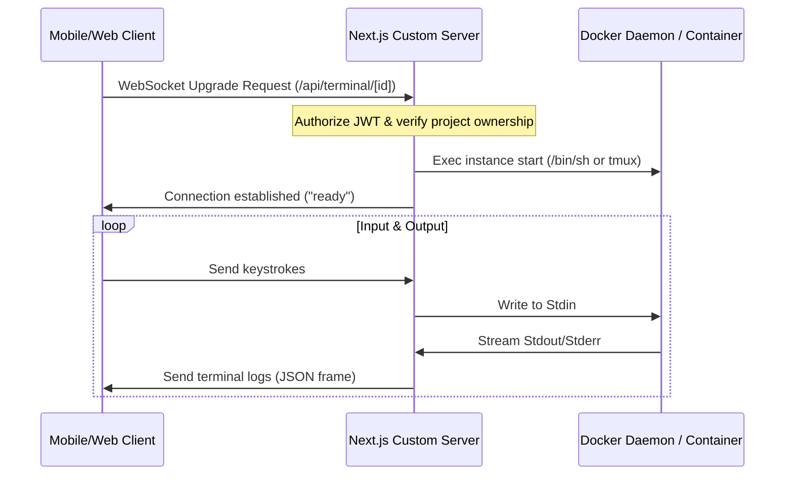
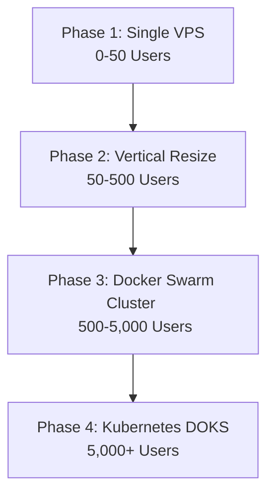

# CloudCode — Universal Cloud Development Environment (CDE)

CloudCode is a next-generation Cloud Development Environment (CDE) platform that enables developers to provision, write, build, and deploy full-stack applications directly from a mobile or web client. CloudCode replicates the native PC developer experience within a sandboxed, multi-tenant container network.

This document serves as the **complete single source of truth (A to Z)** for the CloudCode repository. It captures all architectural systems, database structures, client layouts, deployment pipelines, recent production updates, and scaling roadmaps.

---

## 📂 Repository Directory Map

CloudCode is structured as a monorepo consisting of the following key directories:

```text
cloudcode/
├── .github/
│   └── workflows/
│       └── deploy.yml          # GitHub Actions CI/CD (Backend VPS Deploy)
├── backend/                    # Next.js 16 Custom Server API & Proxy
│   ├── src/
│   │   ├── app/                # App Router Endpoints
│   │   │   ├── api/
│   │   │   │   ├── ai/         # AI integration handlers
│   │   │   │   ├── auth/       # GitHub OAuth Callback & Handlers
│   │   │   │   ├── preview/    # Dynamic reverse-proxy endpoints
│   │   │   │   ├── projects/   # CRUD Project management & workspace setup
│   │   │   │   └── user/       # User profile & SSH key management
│   │   ├── lib/                # Shared utilities & Core logic
│   │   │   ├── activityTracker.ts  # Workspace inactivity tracker
│   │   │   ├── auth.ts         # User auth middleware
│   │   │   ├── docker.ts       # Docker daemon control interface
│   │   │   ├── git.ts          # Git command executors
│   │   │   ├── supabase.ts     # DB connector
│   │   │   ├── terminal.ts     # node-pty terminal stream bridge
│   │   │   └── types.ts
│   │   └── server.ts           # HTTP & WebSocket Next.js Custom Server
│   ├── package.json
│   └── tsconfig.json
├── mobile/                     # React Native / Expo Mobile Application
│   ├── app/
│   │   ├── (tabs)/
│   │   │   ├── ai.tsx          # AI Prompt Helper Interface
│   │   │   ├── dashboard.tsx   # Uptime stats & Shortcuts
│   │   │   ├── projects.tsx    # Workspace grids & states
│   │   │   └── settings.tsx    # User settings & configuration
│   │   ├── project/[id]/
│   │   │   ├── editor.tsx      # Monaco-based file editor
│   │   │   └── index.tsx       # Live terminal and file browser
│   │   ├── auth.tsx            # Login Screen
│   │   ├── index.tsx           # Entry & Auth router gate
│   │   └── new-project.tsx     # Workspace creator & GitHub clone wizard
│   ├── components/             # Reusable UI elements
│   ├── store/                  # Zustand global application store
│   └── package.json
└── README.md                   # This file (Master System Documentation)
```

---

## ⚙️ Core Architectural Subsystems

### 1. Custom HTTP & WebSocket Server
The backend utilizes a custom server built in [server.ts](file:///c:/Users/pathu/OneDrive/Desktop/cloudcode/backend/src/server.ts) that wraps Next.js. This architecture allows the platform to:
* Handle standard Next.js Server-Side Rendering (SSR) and HTTP API requests.
* Intercept `upgrade` headers to hijack and direct WebSocket traffic for interactive shells.
* Intercept HMR (Hot Module Replacement) and Vite live-reload WebSocket signals from running containers and proxy them back to clients.

### 2. Terminal & Docker Stream Interceptor
Interactive terminal sessions are powered by `node-pty` and custom bridges inside the containers:
* When a user opens the terminal in [app/project/[id]/index.tsx](file:///c:/Users/pathu/OneDrive/Desktop/cloudcode/mobile/app/project/%5Bid%5D/index.tsx), the client connects to `ws://<backend>/api/terminal/<projectId>`.
* The server attaches a shell session to the project's isolated Docker container via `dockerode` interactive execution (`docker exec`).
* Standard input/output streams are bridged bidirectionally through the WebSocket connection to the terminal renderer (`xterm.js` or mobile native terminal emulator) in real-time.



### 3. Dynamic Port Discovery & Preview Proxy
To solve port collision problems (e.g. multi-tenant containers running standard ports like `3000` or `5173` concurrently):
* A user's development server starts on a local port (e.g. `3000`) *inside* their isolated container.
* The Next.js preview endpoint [api/preview](file:///c:/Users/pathu/OneDrive/Desktop/cloudcode/backend/src/app/api/preview/%5Bid%5D/%5B%5B...path%5D%5D/route.ts) inspects the container's internal Docker bridge IP address (e.g. `172.17.0.4`) via `dockerode`.
* The proxy acts as a reverse proxy, rewriting headers (e.g. host header overrides, WebSocket upgrade headers, cookie forwards) and forwarding traffic to `http://172.17.0.4:3000`.
* **Tenant Isolation:** Multiple developers can preview their projects on port `3000` at the same time without port conflicts.

### 4. In-Memory Activity Tracker & Auto-Sleep Cron
To minimize server resource consumption on the VPS:
* **Tracking:** [activityTracker.ts](file:///c:/Users/pathu/OneDrive/Desktop/cloudcode/backend/src/lib/activityTracker.ts) logs any user activity (terminal keypress, preview HTTP request, file save API call, project detail load).
* **Auto-Sleep:** A background cron job in [server.ts](file:///c:/Users/pathu/OneDrive/Desktop/cloudcode/backend/src/server.ts) runs every 5 minutes. If a container registers no activity for 30 minutes, it stops (`docker stop <id>`) and the project status in the database changes to `'sleeping'`.
* **Auto-Wake:** The instant the user visits the project or triggers a preview, the server wakes the container up (~2 seconds overhead) and redirects the user, ensuring zero data loss and minimal memory consumption.

---

## 🔒 Parity & Virtual Private Server (VPS) Tuning

### 1. Hardware Memory Caps & swapfile Configuration
Running Next.js Turbopack compilers inside thin virtual workspaces can cause memory spikes of up to 1.5GB, leading to host-level Out-Of-Memory (OOM) crashes.
* **CPU and Memory Limits:** Individual developer containers are restricted to **1GB RAM** (`Memory: 1073741824`) and **512 CPU shares** (`CpuShares: 512`) during creation in [docker.ts](file:///c:/Users/pathu/OneDrive/Desktop/cloudcode/backend/src/lib/docker.ts).
* **VPS Swap Space:** A **2GB swapfile** is configured directly in the DigitalOcean VPS Linux kernel. This allows compilation memory bursts to overflow safely to disk, preventing the Docker daemon from crashing.

### 2. God-Mode Container Permissions
To replicate the freedom of a local PC:
* Sudo privileges are configured inside the base image.
* The file `/etc/sudoers` contains the line `coder ALL=(ALL) NOPASSWD:ALL`, allowing developers to install packages (`apt-get install`), test custom servers, and configure databases within their isolated container.

### 3. Tenant Networking Isolation
To prevent cross-tenant network snooping (e.g., users using network scanners like `nmap` to discover other active containers):
* When a workspace spins up in [docker.ts](file:///c:/Users/pathu/OneDrive/Desktop/cloudcode/backend/src/lib/docker.ts), it is assigned an isolated virtual network (`docker network create workspace-[id]`).
* Containers are isolated from the default Docker bridge, preventing inter-container communications while maintaining public internet access for cloning and package downloads.

---

## 💾 Database (Supabase) Integration & RLS Rules

The database utilizes **Supabase PostgreSQL** for storing projects, users, and session information.

### Core Tables
1. **`users`**: Stores GitHub user identity, access tokens, email, avatar, and SSH keys.
2. **`projects`**: Contains project configurations.
   - `id` (UUID - Primary Key)
   - `name` (String)
   - `container_id` (String)
   - `status` (`'creating' | 'ready' | 'sleeping' | 'error'`)
   - `port` (Integer, default dev server port)
   - `user_github_id` (GitHub ID reference)
   - `git_url` (String, for imported repositories)

### Database Security
* **Row Level Security (RLS):** Policies are enforced on the `projects` table. Developers can only query, modify, or delete project rows where the `user_github_id` matches their authenticated GitHub user ID:
  ```sql
  CREATE POLICY "Users can only modify their own projects"
  ON projects FOR ALL
  USING (auth.uid() = user_github_id);
  ```

---

## 🔌 API Route Registry (Backend App Router)

| Method | Endpoint | Description |
| :--- | :--- | :--- |
| **GET** | `/api/auth/github` | Initiates the GitHub OAuth redirect workflow. |
| **GET** | `/api/auth/callback` | Receives GitHub token, creates/updates Supabase user session. |
| **GET** | `/api/projects` | List all project workspaces belonging to the authenticated user. |
| **POST** | `/api/projects` | Creates a new project from a predefined template (`Node`, `React`, `Blank`). |
| **GET** | `/api/projects/[id]` | Fetch status and workspace information (updates activity). |
| **DELETE** | `/api/projects/[id]` | Deletes workspace files, stops/removes container, deletes database record. |
| **POST** | `/api/projects/import` | Bootstraps container and clones a repository from a GitHub URL. |
| **GET/POST/PUT/DELETE** | `/api/projects/[id]/files` | Read, write, create, or delete files inside the container workspace. |
| **GET** | `/api/projects/[id]/git/status` | Executes `git status` inside the container. |
| **POST** | `/api/projects/[id]/git/stage` | Stages changes (`git add`). |
| **POST** | `/api/projects/[id]/git/commit` | Commits changes (`git commit -m <message>`). |
| **GET/POST** | `/api/projects/[id]/git/branches` | Fetch, create, or switch git branches. |
| **GET** | `/api/projects/[id]/git/diff` | Review git diff outputs. |
| **POST** | `/api/projects/[id]/git/sync` | Executes git `push` / `pull` commands. |
| **GET** | `/api/preview/[id]/[[...path]]` | Intercepts, rewrites, and reverse-proxies requests to the container IP. |

---

## 📱 Mobile Screen Registry (React Native / Expo)

* **Entry/Landing (`app/index.tsx`)**: Decides if a user needs to login or redirects to the dashboard.
* **Authentication (`app/auth.tsx`)**: Integrates GitHub login via an in-app browser overlay.
* **Dashboard (`app/(tabs)/dashboard.tsx`)**:
  - Displays usage metrics (active containers, RAM consumption, uptime).
  - Showcases recent activities and logs.
  - Lists quick-action shortcuts for the last active workspaces.
* **Projects Listing (`app/(tabs)/projects.tsx`)**: Displays all project cards. Shows states (`creating`, `sleeping`, `ready`) with toggle buttons to run/stop them.
* **Workspace Creation Wizard (`app/new-project.tsx`)**:
  - **Option 1:** Bootstraps from templates (Blank, Node, React).
  - **Option 2:** Clone from a remote Git URL.
* **Terminal & Explorer (`app/project/[id]/index.tsx`)**:
  - Split view containing an interactive xterm terminal emulator.
  - File browser sidebar to view folders, modify structure, and open the code editor.
* **Code Editor (`app/project/[id]/editor.tsx`)**: Text editor optimized for mobile code modification with direct auto-save syncing back to the container filesystem.
* **AI Copilot (`app/(tabs)/ai.tsx`)**: AI conversational assistant interface designed for code generation, bug fixing, and package management.
* **Settings (`app/(tabs)/settings.tsx`)**: User account management, theme toggles, database variables, and platform information.

---

## 🛠️ GitHub Actions CI/CD Pipeline

The project utilizes automated deployment workflows defined in [.github/workflows/deploy.yml](file:///c:/Users/pathu/OneDrive/Desktop/cloudcode/.github/workflows/deploy.yml):

```yaml
name: Deploy Backend

on:
  push:
    branches:
      - main
    paths:
      - 'backend/**'
      - '.github/workflows/**'

jobs:
  deploy:
    runs-on: ubuntu-latest
    steps:
      - name: Checkout Code
        uses: actions/checkout@v4

      - name: Deploy via SSH
        uses: appleboy/ssh-action@v1.0.3
        with:
          host: ${{ secrets.VPS_HOST }}
          username: ${{ secrets.VPS_USER }}
          key: ${{ secrets.VPS_SSH_KEY }}
          script: |
            cd /root/cloudcode/backend 
            git pull origin main
            npm install
            npm run build
            pm2 restart cloudcode-backend
```

---

## 🩹 Recent Critical Fixes & History

### 1. GitHub Actions Trigger Optimization
* **Issue:** Pushes to the `mobile` folder were triggering the backend deployment runner, causing unnecessary builds on the VPS.
* **Fix:** Configured `paths` rules in [.github/workflows/deploy.yml](file:///c:/Users/pathu/OneDrive/Desktop/cloudcode/.github/workflows/deploy.yml). The workflow now only triggers when changes are made inside `backend/` or `.github/workflows/`. If a push modifies both frontend and backend code, the backend deployment still runs correctly.

### 2. Next.js Production Startup Crash
* **Issue:** Next.js was crashing on startup on the VPS, throwing `ENOENT: no such file or directory, open '/root/cloudcode/backend/.next/dev/required-server-files.json'`.
* **Cause 1:** PM2 was running the backend start command without the `NODE_ENV=production` environment variable set. Next.js fell back to development mode and looked for development files inside the production build folder.
* **Cause 2:** In [server.ts](file:///c:/Users/pathu/OneDrive/Desktop/cloudcode/backend/src/server.ts), `loadEnvConfig()` was called *after* checking `process.env.NODE_ENV !== 'production'`. Because of this, variables from `.env` files were not loaded in time to initialize Next.js in production mode.
* **Fix:**
  - Moved `loadEnvConfig()` to the very top of [server.ts](file:///c:/Users/pathu/OneDrive/Desktop/cloudcode/backend/src/server.ts) to ensure environment files load first.
  - Prepended `"start": "NODE_ENV=production tsx src/server.ts"` to [package.json](file:///c:/Users/pathu/OneDrive/Desktop/cloudcode/backend/package.json).
  - Ran PM2 update commands with `--update-env` to clear cached development variables.

### 3. Stale Preview Port & ECONNREFUSED Crash
* **Issue:** Connecting to a project preview failed with `connect ECONNREFUSED 172.17.0.2:<old_port>`.
* **Cause 1:** When a container was recreated (due to self-healing or Docker host pruning) by `ensureContainerRunning`, it received a new random host-mapped port, but the `port` column in the Supabase database was not updated.
* **Cause 2:** The project detail endpoint (`GET /api/projects/[id]`) preferred the database `port` column over the container's active mappings, passing a stale public port to the client.
* **Cause 3:** The preview proxy target resolver did not handle fallback logic if the requested client port did not match any active host port mappings (e.g., if it was stale).
* **Fix:**
  - Modified [docker.ts](file:///c:/Users/pathu/OneDrive/Desktop/cloudcode/backend/src/lib/docker.ts) to update the `port` column in the database whenever a container is recreated.
  - Modified [route.ts](file:///c:/Users/pathu/OneDrive/Desktop/cloudcode/backend/src/app/api/projects/%5Bid%5D/route.ts) (project details) to prioritize the container's active host-mapped port over the stored database value when the container is running.
  - Modified [route.ts](file:///c:/Users/pathu/OneDrive/Desktop/cloudcode/backend/src/app/api/preview/%5Bid%5D/%5B%5B...path%5D%5D/route.ts) (preview proxy) to fall back to the default internal port `3000` if the requested port does not match any active container host bindings and is not a standard internal port.

---

## 📈 Pricing, Concurrency & Cost Model (At 5K Users)

### Tier Allocations
* **Free (Ad-Supported):** 512MB RAM container, 256 CPU shares, 1 active workspace, 10 min idle sleep timeout, no custom domain.
* **Pro ($29/mo):** 2GB RAM container, 1024 CPU shares, 10 workspaces, 2-hour idle sleep timeout, custom domains.
* **Enterprise ($99/mo):** 4GB RAM container, 2048 CPU shares, unlimited workspaces, 6-hour idle sleep timeout, always-on container (1 project).

### Concurrency Math
With 5,000 registered users, we assume:
* **Daily Active Users (DAU):** ~500–750 (10–15%).
* **Peak Concurrent Active Sessions:** ~75–120.
* **Average active containers running simultaneously:** ~60–75 (thanks to the 30-minute auto-sleep feature).
* **Peak memory footprint on the cluster:** ~128–160 GB RAM (including host OS overhead).

### Profit & Loss Breakdown (5,000 Users)
* **Estimated Monthly Revenue:** ~$46,500
* **Infrastructure Costs (DigitalOcean worker swarm, load balancer, storage):** ~$1,100/mo
* **Database (Supabase Pro) + API usage (Gemini API):** ~$250/mo
* **Total Operating Costs:** ~$1,350/mo
* **Gross Profit:** **~$45,150/mo (97% Margin)**

---

## 🚀 Scalability Evolution Roadmap



### Phase 1: Current Setup (Single Droplet)
All backend APIs, preview proxies, and developer containers run on a single DigitalOcean Droplet (4GB). Storage is hosted locally. Cost: ~$24/mo.

### Phase 2: Vertical Resizing
Scale up to a larger 32GB droplet. No code or configuration changes are required. Cost: ~$168/mo.

### Phase 3: Multi-Node Docker Swarm
Separate the API backend from the compute resources. Implement:
* Shared storage (NFS or DigitalOcean Spaces) for project file sharing across nodes.
* A scheduling agent to spin up containers on the worker node with the lowest current load.
* Cost: ~$1,100/mo.

### Phase 4: Kubernetes (DOKS)
Migrate container provisioning commands from local `dockerode` API to Kubernetes pod scheduling APIs. Worker nodes auto-scale based on load. Cost: ~$1,150/mo.

---

## 💻 Local Development Setup

### Backend
1. Navigate to the backend directory:
   ```bash
   cd backend
   ```
2. Install dependencies:
   ```bash
   npm install
   ```
3. Set up a `.env.local` file with your credentials:
   ```env
   SUPABASE_URL=your_supabase_url
   SUPABASE_SERVICE_ROLE_KEY=your_service_role_key
   JWT_SECRET=your_jwt_secret
   ```
4. Run the development server:
   ```bash
   npm run dev
   ```

### Mobile App (Expo)
1. Navigate to the mobile directory:
   ```bash
   cd mobile
   ```
2. Install dependencies:
   ```bash
   npm install
   ```
3. Configure the local connection setup in the `.env` file.
4. Run the development server:
   ```bash
   npx expo start -c
   ```
