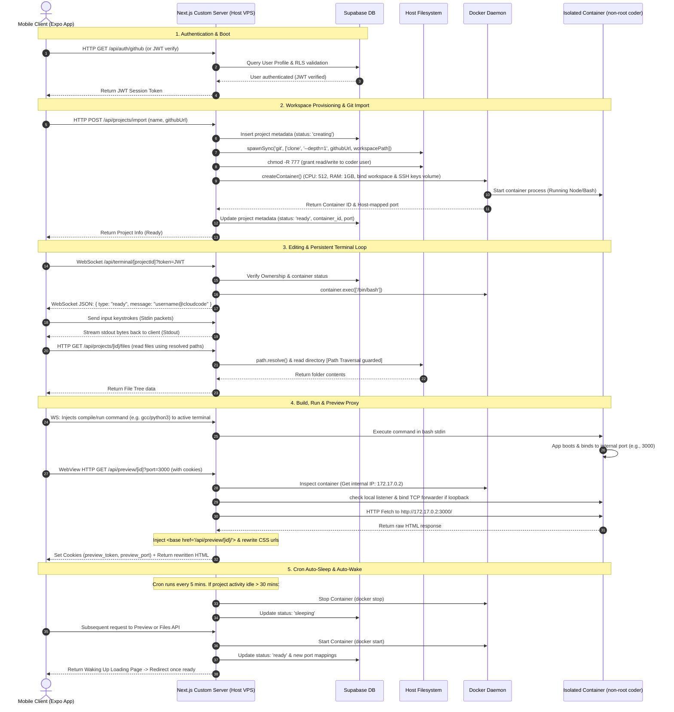
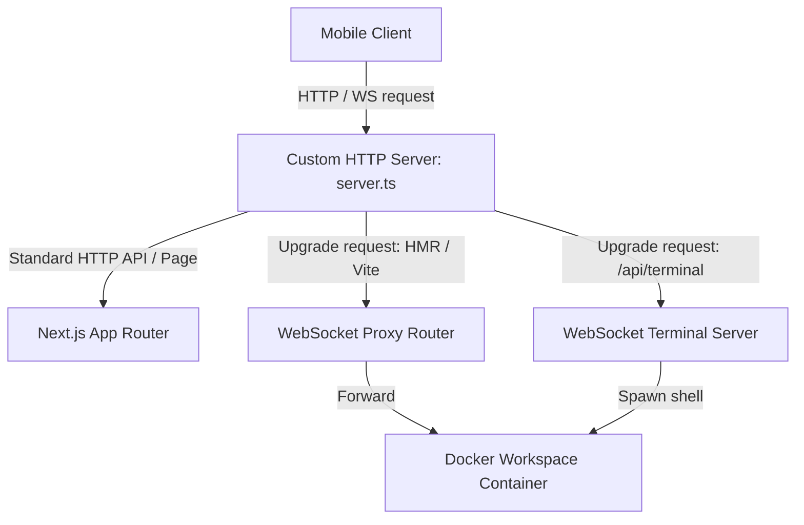
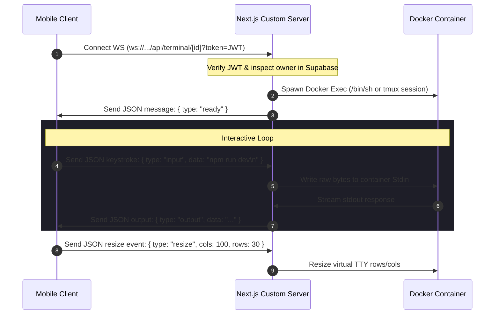
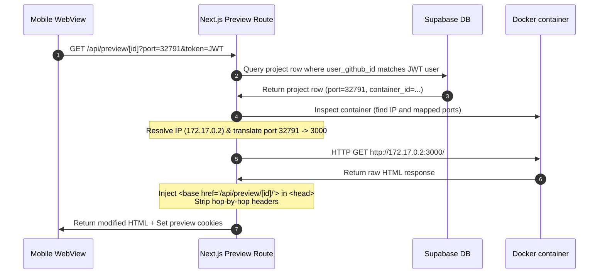
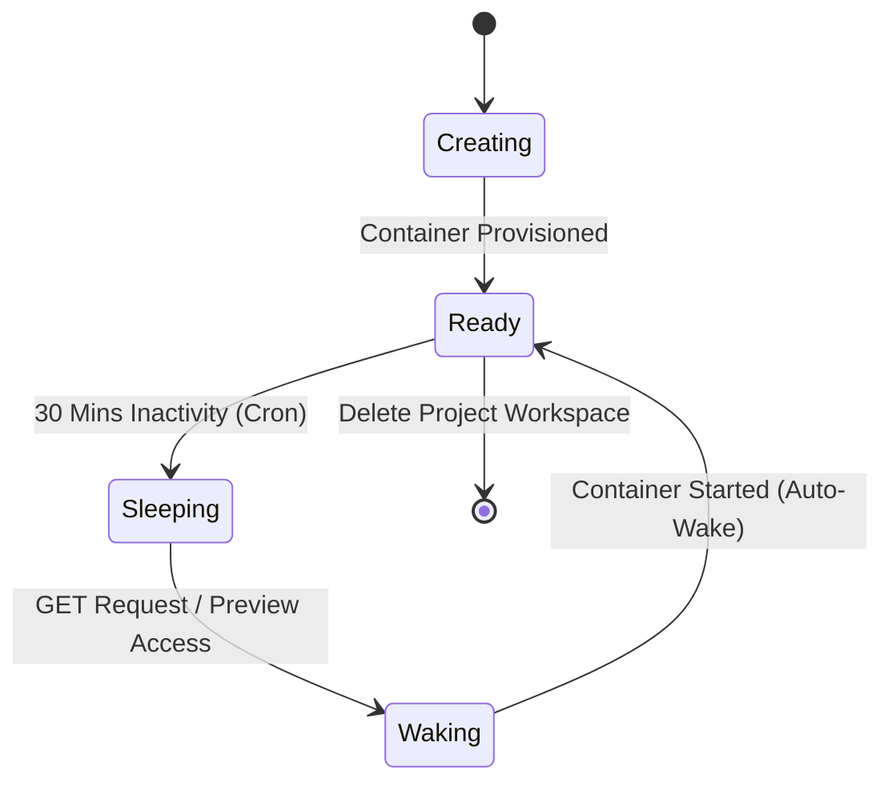

# CloudCode — Cloud Development Environment

CloudCode is a cloud development environment (CDE) platform that allows developers to spin up, edit, build, run, and preview full-stack applications directly from a mobile client. The architecture replicates a native PC development experience by running isolated Docker containers on a Virtual Private Server (VPS) and proxying HTTP/WebSocket traffic dynamically to the client.

---

## 📂 Repository Structure

```text
cloudcode/
├── .github/
│   └── workflows/
│       └── deploy.yml                          # GitHub Actions CI/CD deploy runner
├── backend/                                     # Next.js 16 Custom Server — API, WebSocket & Preview Proxy
│   ├── database/
│   │   ├── schema.sql                           # Full Supabase PostgreSQL schema
│   │   └── migrations/
│   │       ├── 01_agent_governance.sql          # AI agent governance tables
│   │       ├── 02_github_token.sql              # GitHub token column migration
│   │       └── 03_update_project_types.sql      # Project type constraints update
│   ├── src/
│   │   ├── app/
│   │   │   ├── api/
│   │   │   │   └── preview/[id]/[[...path]]/
│   │   │   │       └── route.ts                 # Dynamic preview reverse proxy handler
│   │   │   ├── cc-api/                          # CloudCode core API endpoints
│   │   │   │   ├── ai/
│   │   │   │   │   ├── approve/route.ts         # AI action approval endpoint
│   │   │   │   │   ├── chat/route.ts            # AI chat streaming endpoint
│   │   │   │   │   └── runs/
│   │   │   │   │       ├── route.ts             # AI agent runs list
│   │   │   │   │       └── [id]/
│   │   │   │   │           ├── route.ts         # Individual run details
│   │   │   │   │           ├── approve/route.ts # Run-level approval
│   │   │   │   │           └── chat/route.ts    # Run-level chat
│   │   │   │   ├── auth/
│   │   │   │   │   ├── callback/route.ts        # OAuth callback handler
│   │   │   │   │   ├── github/
│   │   │   │   │   │   ├── route.ts             # GitHub OAuth initiation
│   │   │   │   │   │   └── callback/route.ts    # GitHub OAuth callback
│   │   │   │   │   └── google/
│   │   │   │   │       ├── route.ts             # Google OAuth initiation
│   │   │   │   │       └── callback/route.ts    # Google OAuth callback
│   │   │   │   ├── billing/
│   │   │   │   │   ├── checkout/route.ts        # Dodo Payments checkout session
│   │   │   │   │   ├── status/route.ts          # Subscription status query
│   │   │   │   │   └── webhook/route.ts         # Payment webhook handler
│   │   │   │   ├── git/
│   │   │   │   │   └── prs/
│   │   │   │   │       ├── route.ts             # Pull requests list
│   │   │   │   │       └── [number]/route.ts    # Individual PR details
│   │   │   │   ├── projects/
│   │   │   │   │   ├── route.ts                 # List/create projects
│   │   │   │   │   ├── import/route.ts          # GitHub repo import
│   │   │   │   │   └── [id]/
│   │   │   │   │       ├── route.ts             # Project CRUD operations
│   │   │   │   │       ├── files/
│   │   │   │   │       │   ├── route.ts         # File tree listing
│   │   │   │   │       │   └── content/route.ts # File content read/write
│   │   │   │   │       ├── git/
│   │   │   │   │       │   ├── branches/route.ts  # Branch list/switch
│   │   │   │   │       │   ├── commit/route.ts    # Commit changes
│   │   │   │   │       │   ├── config/route.ts    # Git config management
│   │   │   │   │       │   ├── conflicts/route.ts # Merge conflict detection
│   │   │   │   │       │   ├── diff/route.ts      # Staged diff viewer
│   │   │   │   │       │   ├── log/route.ts       # Commit history log
│   │   │   │   │       │   ├── resolve/route.ts   # Conflict resolution
│   │   │   │   │       │   ├── ssh/route.ts       # SSH key management
│   │   │   │   │       │   ├── stage/route.ts     # Stage/unstage files
│   │   │   │   │       │   ├── status/route.ts    # Working tree status
│   │   │   │   │       │   └── sync/route.ts      # Push/pull sync
│   │   │   │   │       └── terminal/
│   │   │   │   │           └── kill/route.ts    # Terminal process kill
│   │   │   │   ├── system/
│   │   │   │   │   └── diagnostics/route.ts     # VPS runtime diagnostics
│   │   │   │   └── user/
│   │   │   │       ├── route.ts                 # User profile operations
│   │   │   │       └── git/ssh/route.ts         # User SSH key management
│   │   │   ├── global-error.tsx                 # Sentry client-side error boundary
│   │   │   ├── layout.tsx                       # Root layout component
│   │   │   └── page.tsx                         # Root page component
│   │   ├── lib/                                 # Core helper modules & abstractions
│   │   │   ├── activityTracker.ts               # In-memory project idle state manager
│   │   │   ├── ai/
│   │   │   │   ├── gemini.ts                    # Gemini AI model integration & streaming
│   │   │   │   ├── governance.ts                # AI agent governance & policy enforcement
│   │   │   │   └── planningGuard.ts             # AI planning safety guardrails
│   │   │   ├── auth.ts                          # Supabase JWT verification & auth middleware
│   │   │   ├── docker.ts                        # Dockerode socket connector & container controls
│   │   │   ├── git.ts                           # Git command wrapper executed in containers
│   │   │   ├── payments.ts                      # Dodo Payments integration helpers
│   │   │   ├── projects.ts                      # Project CRUD & workspace management logic
│   │   │   ├── supabase.ts                      # Supabase DB admin client config
│   │   │   ├── terminal.ts                      # Terminal shell process WebSocket bridge
│   │   │   ├── tiers.ts                         # Subscription tier definitions & limits
│   │   │   └── types.ts                         # Shared TypeScript type definitions
│   │   ├── middleware.ts                        # Next.js request middleware
│   │   ├── datadog.ts                           # Datadog APM tracing agent bootstrapper
│   │   ├── instrumentation.ts                   # Next.js instrumentation runtime controller
│   │   ├── instrumentation-client.ts            # Next.js client-side Sentry init hook
│   │   ├── sentry.edge.config.ts                # Sentry Edge runtime error monitoring
│   │   ├── sentry.server.config.ts              # Sentry Server/Node.js runtime config
│   │   └── server.ts                            # Custom HTTP & WebSocket server entry point
│   ├── package.json
│   ├── tsconfig.json
│   ├── next.config.ts
│   └── eslint.config.mjs
├── mobile/                                      # React Native / Expo Mobile Client Application
│   ├── app/
│   │   ├── _layout.tsx                          # Root layout with Sentry & navigation providers
│   │   ├── index.tsx                            # Session router gate (auth check)
│   │   ├── auth.tsx                             # Login overlay (GitHub & Google OAuth)
│   │   ├── new-project.tsx                      # Workspace creation wizard (templates / GitHub import)
│   │   ├── activity.tsx                         # Activity audit log feed
│   │   ├── billing/
│   │   │   └── success.tsx                      # Payment success confirmation screen
│   │   ├── (tabs)/                              # Bottom-tab navigator screens
│   │   │   ├── _layout.tsx                      # Tab bar layout with animated floating FAB
│   │   │   ├── dashboard.tsx                    # Statistics, shortcuts, activity feed
│   │   │   ├── projects.tsx                     # Workspace grid/list with container controls
│   │   │   ├── ai.tsx                           # AI assistant interactive prompt view
│   │   │   ├── usage.tsx                        # Usage metrics & resource monitoring
│   │   │   └── settings.tsx                     # Profile preferences, billing & settings
│   │   └── project/[id]/                        # Workspace-specific editor routes
│   │       ├── index.tsx                        # Live terminal, file explorer & preview portal
│   │       └── editor.tsx                       # Multi-file code editor with auto-save
│   ├── components/
│   │   ├── ConfirmModal.tsx                     # Reusable confirmation dialog
│   │   ├── FloatingMic.tsx                      # Floating microphone button
│   │   ├── HugeIconsShim.tsx                    # HugeIcons compatibility layer
│   │   ├── LimitExceededModal.tsx               # Usage limit exceeded dialog
│   │   ├── ProjectIcon.tsx                      # Dynamic project type icon renderer
│   │   ├── SpringPressable.tsx                  # Spring-animated pressable button
│   │   ├── SvgIcon.tsx                          # SVG icon rendering component
│   │   ├── TabGenieWrapper.tsx                  # Tab genie animation wrapper
│   │   ├── ide/                                 # IDE / Tablet layout components
│   │   │   ├── ActivityBar.tsx                  # VS Code-style activity sidebar
│   │   │   ├── AppStatusBar.tsx                 # Bottom status bar
│   │   │   ├── AppTitleBar.tsx                  # Window title bar
│   │   │   ├── BottomPanel.tsx                  # Resizable bottom panel (terminal)
│   │   │   ├── DesktopMousePointer.tsx          # Desktop cursor simulation
│   │   │   ├── EditorTabBar.tsx                 # Multi-tab editor header
│   │   │   ├── GlobalHotkeyBridge.tsx           # Keyboard shortcut handler
│   │   │   ├── InlineEditor.tsx                 # Inline code editor component
│   │   │   ├── MenuBar.tsx                      # Top menu bar (File, Edit, View...)
│   │   │   ├── RightPanel.tsx                   # Right sidebar panel
│   │   │   ├── Sidebar.tsx                      # File explorer sidebar
│   │   │   ├── StatusBar.tsx                    # Editor status bar
│   │   │   ├── TabletAppShell.tsx               # Tablet IDE full shell layout
│   │   │   ├── TabletIDEShell.tsx               # Tablet IDE inner shell
│   │   │   ├── TabletSidebarNav.tsx             # Tablet sidebar navigation
│   │   │   └── TitleBar.tsx                     # Editor title bar
│   │   ├── onboarding/                          # Onboarding flow components
│   │   │   ├── AnimatedDot.tsx                  # Animated pagination dot
│   │   │   ├── GridBackground.tsx               # Animated grid background
│   │   │   ├── LogoIcons.tsx                    # Logo icon set
│   │   │   ├── OnboardingPage.tsx               # Onboarding page template
│   │   │   └── ScreenIllustrations.tsx          # Onboarding screen illustrations
│   │   └── project/                             # Workspace tab components
│   │       ├── AITab.tsx                        # Workspace-scoped AI assistant tab
│   │       ├── FilesTab.tsx                     # File tree explorer tab
│   │       ├── GitTab.tsx                       # Git staging, commit & sync tab
│   │       ├── PRsTab.tsx                       # Pull requests management tab
│   │       ├── PreviewTab.tsx                   # Live app preview WebView tab
│   │       └── TerminalTab.tsx                  # Interactive terminal emulator tab
│   ├── store/                                   # Zustand global state management
│   │   ├── agentStore.ts                        # AI agent run state
│   │   ├── ai.ts                                # AI chat state & message history
│   │   ├── auth.ts                              # Authentication session state
│   │   ├── prStore.ts                           # Pull request state
│   │   ├── projects.ts                          # Project list & workspace state
│   │   ├── tabletLayoutStore.ts                 # Tablet layout panels state
│   │   ├── terminal.ts                          # Terminal session state
│   │   ├── theme.ts                             # Theme & appearance state
│   │   └── ui.ts                                # UI interaction state
│   ├── lib/                                     # Client-side helper modules
│   │   ├── api.ts                               # Backend API client functions
│   │   ├── appAudit.ts                          # Activity audit logging service
│   │   ├── auth.ts                              # OAuth & session management
│   │   ├── haptics.ts                           # Haptic feedback utilities
│   │   ├── permissions.ts                       # Device permission handlers
│   │   └── supabase.ts                          # Supabase client config
│   ├── hooks/                                   # Custom React hooks
│   │   ├── useAppTheme.ts                       # Theme hook
│   │   ├── useCache.ts                          # Async storage cache hook
│   │   ├── useDeviceType.ts                     # Phone/tablet detection hook
│   │   ├── useGlobalKeyboardShortcuts.ts        # Keyboard shortcut hook
│   │   ├── useScrollVisibility.ts               # Scroll-based visibility hook
│   │   ├── useTabletLayout.ts                   # Tablet layout management hook
│   │   └── useTerminal.ts                       # WebSocket terminal connection hook
│   ├── constants/
│   │   └── tokens.ts                            # Design tokens (colors, spacing)
│   ├── types/
│   │   ├── index.ts                             # Shared TypeScript interfaces
│   │   └── svg.d.ts                             # SVG module declarations
│   ├── plugins/
│   │   └── withExcludeSupport.js                # Expo config plugin
│   ├── assets/                                  # App icons, logos & splash assets
│   ├── package.json
│   ├── app.json                                 # Expo app configuration
│   ├── eas.json                                 # EAS Build configuration
│   ├── tsconfig.json
│   ├── babel.config.js
│   └── metro.config.js
├── web/                                         # Marketing Website (Next.js)
│   ├── src/
│   │   ├── app/
│   │   │   ├── layout.tsx                       # Root layout with fonts & metadata
│   │   │   ├── page.tsx                         # Landing page
│   │   │   ├── globals.css                      # Global styles & theme tokens
│   │   │   ├── robots.ts                        # SEO robots.txt generator
│   │   │   ├── sitemap.ts                       # SEO sitemap generator
│   │   │   ├── privacy/page.tsx                 # Privacy policy page
│   │   │   ├── terms/page.tsx                   # Terms of service page
│   │   │   └── delete-account/page.tsx          # Account deletion page
│   │   ├── components/
│   │   │   ├── Header.tsx                       # Navigation header
│   │   │   ├── Footer.tsx                       # Site footer
│   │   │   ├── landing/
│   │   │   │   ├── Faqs.tsx                     # FAQ accordion section
│   │   │   │   ├── InteractiveShowcase.tsx      # Interactive feature showcase
│   │   │   │   └── PhoneMockup/
│   │   │   │       ├── PhoneMockup.tsx          # Animated phone frame
│   │   │   │       ├── MockupScreens.tsx        # Mockup screen content
│   │   │   │       └── constants.tsx            # Mockup configuration
│   │   │   └── ui/
│   │   │       ├── AnimatedNumber.tsx           # Counter animation component
│   │   │       ├── DecryptText.tsx              # Text decrypt reveal effect
│   │   │       └── ScrollReveal.tsx             # Scroll-triggered reveal animation
│   │   └── hooks/
│   │       └── useTheme.ts                      # Theme toggle hook
│   ├── public/
│   │   ├── assets/                              # Store badges (App Store, Play Store)
│   │   ├── cloudcodeicon.svg                    # App icon (SVG)
│   │   ├── cloudcodelogo.png                    # Logo (dark)
│   │   ├── cloudcodelogolight.png               # Logo (light)
│   │   └── icon.png                             # Favicon source
│   ├── package.json
│   ├── tsconfig.json
│   ├── next.config.ts
│   └── postcss.config.mjs
├── scripts/
│   ├── sidecar.js                               # Sidecar utility script
│   └── vps-security-setup.sh                    # VPS hardening & Docker security setup
├── Dockerfile                                   # Container image build definition
├── docker-daemon.json                           # Docker daemon configuration (ICC, log rotation)
└── README.md
```

---

## 🗺️ End-to-End Architecture Diagram

The sequence diagram below maps how the mobile client, Next.js custom server, Supabase DB, host filesystem, and Docker daemon collaborate across all runtime operations.


```mermaid
sequenceDiagram
    autonumber
    actor Developer as Mobile Client (Expo App)
    participant Server as Next.js Custom Server (Host VPS)
    participant DB as Supabase DB
    participant HostFS as Host Filesystem
    participant Docker as Docker Daemon
    participant Container as Isolated Container (non-root coder)
    
    %% Section 1: Auth & Bootstrap
    Note over Developer, DB: 1. Authentication & Boot
    Developer->>Server: HTTP GET /api/auth/github (or JWT verify)
    Server->>DB: Query User Profile & RLS validation
    DB-->>Server: User authenticated (JWT verified)
    Server-->>Developer: Return JWT Session Token
    
    %% Section 2: Workspace Creation
    Note over Developer, Container: 2. Workspace Provisioning & Git Import
    Developer->>Server: HTTP POST /api/projects/import (name, githubUrl)
    Server->>DB: Insert project metadata (status: 'creating')
    Server->>HostFS: spawnSync('git', ['clone', '--depth=1', githubUrl, workspacePath])
    Server->>HostFS: chmod -R 777 (grant read/write to coder user)
    Server->>Docker: createContainer() (CPU: 512, RAM: 1GB, bind workspace & SSH keys volume)
    Docker->>Container: Start container process (Running Node/Bash)
    Docker-->>Server: Return Container ID & Host-mapped port
    Server->>DB: Update project metadata (status: 'ready', container_id, port)
    Server-->>Developer: Return Project Info (Ready)
    
    %% Section 3: Editing & Persistent Terminal
    Note over Developer, Container: 3. Editing & Persistent Terminal Loop
    Developer->>Server: WebSocket /api/terminal/[projectId]?token=JWT
    Server->>DB: Verify Ownership & container status
    Server->>Docker: container.exec(['/bin/bash'])
    Server-->>Developer: WebSocket JSON: { type: "ready", message: "username@cloudcode" }
    Developer->>Server: Send input keystrokes (Stdin packets)
    Server-->>Developer: Stream stdout bytes back to client (Stdout)
    Developer->>Server: HTTP GET /api/projects/[id]/files (read files using resolved paths)
    Server->>HostFS: path.resolve() & read directory [Path Traversal guarded]
    HostFS-->>Server: Return folder contents
    Server-->>Developer: Return File Tree data
    
    %% Section 4: App Running & Preview Proxy
    Note over Developer, Container: 4. Build, Run & Preview Proxy
    Developer->>Server: WS: Injects compile/run command (e.g. gcc/python3) to active terminal
    Server->>Container: Execute command in bash stdin
    Container->>Container: App boots & binds to internal port (e.g., 3000)
    Developer->>Server: WebView HTTP GET /api/preview/[id]?port=3000 (with cookies)
    Server->>Docker: Inspect container (Get internal IP: 172.17.0.2)
    Server->>Container: check local listener & bind TCP forwarder if loopback
    Server->>Container: HTTP Fetch to http://172.17.0.2:3000/
    Container-->>Server: Return raw HTML response
    Note over Server: Inject <base href="/api/preview/[id]/"> & rewrite CSS urls
    Server-->>Developer: Set Cookies (preview_token, preview_port) + Return rewritten HTML
    
    %% Section 5: Cron Auto-Sleep & Auto-Wake
    Note over Developer, Container: 5. Cron Auto-Sleep & Auto-Wake
    Note over Server: Cron runs every 5 mins. If project activity idle > 30 mins:
    Server->>Docker: Stop Container (docker stop)
    Server->>DB: Update status: 'sleeping'
    Developer->>Server: Subsequent request to Preview or Files API
    Server->>Docker: Start Container (docker start)
    Server->>DB: Update status: 'ready' & new port mappings
    Server-->>Developer: Return Waking Up Loading Page -> Redirect once ready
```

---

## ⚙️ Core Architectural Subsystems

### 1. Custom HTTP & WebSocket Server

The backend runs on a custom server configured in `server.ts`. Rather than using the default `next start` server, this custom setup runs an HTTP server using Node's native `http` module and boots the Next.js application as middleware.


```mermaid
graph TD
    Client[Mobile Client] -->|HTTP / WS request| CustomServer[Custom HTTP Server: server.ts]
    CustomServer -->|Standard HTTP API / Page| NextJS[Next.js App Router]
    CustomServer -->|Upgrade request: /api/terminal| WSS_Terminal[WebSocket Terminal Server]
    CustomServer -->|Upgrade request: HMR / Vite| WS_Proxy[WebSocket Proxy Router]
    WS_Proxy -->|Forward| DockerContainer[Docker Workspace Container]
    WSS_Terminal -->|Spawn shell| DockerContainer
```

Key features:
* **WebSocket Interception:** Listens for `upgrade` requests on the server port. Requests matching `/api/terminal/*` are routed directly to the terminal WebSocket handler.
* **WebSocket Reverse Proxying:** Listens for Hot Module Replacement (HMR) and Vite live-reload WebSocket requests (`/_next/webpack-hmr`, `/__vite`, `/ws`, `/ws?*`) and proxies them directly to the corresponding active container on the Docker bridge network.
* **Statelessness:** Stores no state in memory, allowing it to boot instantly and handle high volumes of concurrent HTTP and WebSocket requests.

---

### 2. Interactive Terminal Shell System

Real-time console interaction is managed through a bridge between the client terminal view, Node WebSockets, and Docker commands.

* **Client Setup:** The mobile app initiates a connection to `ws://<backend-url>/api/terminal/[projectId]?token=<jwt>&terminalId=<id>`.
* **Verification & Handshake:** The server authorizes the token using Supabase keys, verifies project ownership, and inspects the database to ensure the corresponding container is running.
* **Container Exec Spawn:** The server calls `dockerode.exec` to launch `/bin/sh` or connect to a `tmux` session inside the container:
  ```typescript
  Cmd: ['/bin/sh', '-c', 'if command -v tmux >/dev/null 2>&1; then exec tmux new-session -A -s "cloudcode-..."; else exec /bin/sh; fi']
  ```
* **Interactive Stream Bridge:** The input/output streams of the exec process are multiplexed over the WebSocket connection.
* **Packet Protocol:** Messages exchanged via WebSocket are structured JSON frames:
  - **Input (Client -> Server):** `{ "type": "input", "data": "ls -la\n" }`
  - **Resize (Client -> Server):** `{ "type": "resize", "cols": 80, "rows": 24 }` (calls `exec.resize` to redraw terminal output correctly).
  - **Output (Server -> Client):** `{ "type": "output", "data": "..." }`
  - **Ready (Server -> Client):** `{ "type": "ready", "message": "..." }`


```mermaid
sequenceDiagram
    autonumber
    participant Client as Mobile Client
    participant Server as Next.js Custom Server
    participant Container as Docker Container
    
    Client->>Server: Connect WS (ws://.../api/terminal/[id]?token=JWT)
    Note over Server: Verify JWT & inspect owner in Supabase
    Server->>Container: Spawn Docker Exec (/bin/sh or tmux session)
    Server->>Client: Send JSON message: { type: "ready" }
    
    rect rgb(30, 30, 40)
        Note over Client, Container: Interactive Loop
        Client->>Server: Send JSON keystroke: { type: "input", data: "npm run dev\n" }
        Server->>Container: Write raw bytes to container Stdin
        Container->>Server: Stream stdout response
        Server->>Client: Send JSON output: { type: "output", data: "..." }
    end
    
    Client->>Server: Send JSON resize event: { type: "resize", cols: 100, rows: 30 }
    Server->>Container: Resize virtual TTY rows/cols
```

---

### 3. Dynamic Preview Proxy Layer

When a user launches a web app (e.g. Vite, React, Express) inside their container, the application listens on an internal port (e.g. `3000` or `5173`). The preview proxy maps these internal ports to clean, authenticated preview endpoints.

* **Target Resolution:** Inspects the container configuration via `dockerode.inspect()` to get its internal IP address on the Docker bridge network (e.g. `172.17.0.2`). It iterates through container port bindings to resolve host-mapped ports back to their internal values.
* **HTTP Reverse Proxying:** Sends requests to `http://<container-ip>:<internal-port>/<sub-path>` using Node `fetch` with manual redirect handling and a `120s` timeout for compilation tasks.
* **Header & Cookie Management:**
  - Injects `Host` header overrides matching the container's virtual target (`localhost:<internal-port>`).
  - Sets cookies (`preview_project_id`, `preview_token`, `preview_port`) on initial load to ensure subsequent resource loads are authenticated and routed correctly.
* **HTML Base Tag Injection:** Modifies HTML responses to inject a `<base>` tag in the `<head>` block:
  ```html
  <base href="/api/preview/[projectId]/">
  ```
  This forces the client browser to resolve all relative assets (images, stylesheets, scripts) through the authenticated proxy route automatically.
* **CSS URL Rewriting:** Parses CSS stylesheets and prepends the proxy path to all `url(/...)` references to route background assets correctly.
* **Smart Proxy Fallback:** If the requested port is not found in the container's active host bindings, the proxy checks if the port is a standard internal port (e.g. `3000`, `5173`). If it's a non-standard port, it falls back to internal port `3000` and logs a warning instead of failing.


```mermaid
sequenceDiagram
    autonumber
    participant WebView as Mobile WebView
    participant Proxy as Next.js Preview Route
    participant DB as Supabase DB
    participant Container as Docker container
    
    WebView->>Proxy: GET /api/preview/[id]?port=32791&token=JWT
    Proxy->>DB: Query project row where user_github_id matches JWT user
    DB->>Proxy: Return project row (port=32791, container_id=...)
    Proxy->>Container: Inspect container (find IP and mapped ports)
    Note over Proxy: Resolve IP (172.17.0.2) & translate port 32791 -> 3000
    Proxy->>Container: HTTP GET http://172.17.0.2:3000/
    Container->>Proxy: Return raw HTML response
    Note over Proxy: Inject <base href="/api/preview/[id]/"> in <head><br>Strip hop-by-hop headers
    Proxy->>WebView: Return modified HTML + Set preview cookies
```

---

### 4. Activity Tracker & Auto-Sleep/Auto-Wake Engine

To conserve resources on the VPS:

* **In-Memory Store (`activityTracker.ts`):** Manages a map tracking project activity timestamps.
* **Activity Hooks:** Updates the project's timestamp whenever:
  - An HTTP API call loads project details.
  - A file is opened, modified, or saved.
  - A WebSocket connection is opened or terminal input is received.
  - A request is handled by the preview proxy.
* **The Auto-Sleep Cron:** A `setInterval` job in `server.ts` runs every 5 minutes:
  1. Queries all projects marked as `'ready'` in the database.
  2. Compares the current time with the last active timestamp in the tracker.
  3. If a project has been idle for more than 30 minutes, it stops the container (`docker stop`) and updates the project status in the database to `'sleeping'`.
* **The Auto-Wake Middleware:** When a user visits their workspace or accesses the preview, the server calls `ensureContainerRunning()`. If the container is sleeping, it:
  1. Wakes the container up (`docker start`).
  2. Updates its status in the database to `'ready'`.
  3. Updates the `port` column in the database with its new public port.
  4. Returns a styled `"Waking up..."` loading page to the client, redirecting them once the container is ready.


```mermaid
stateDiagram-v2
    [*] --> Creating
    Creating --> Ready : Container Provisioned
    Ready --> Sleeping : 30 Mins Inactivity (Cron)
    Sleeping --> Waking : GET Request / Preview Access
    Waking --> Ready : Container Started (Auto-Wake)
    Ready --> [*] : Delete Project Workspace
```

---

### 5. Workspace Templates & Git Import System

Workspaces are initialized using one of two methods:

* **From Local Template:**
  - Creates a workspace folder inside `projects/[id]/`.
  - Seeds configuration files depending on the selected type:
    - **`node`:** Sets up a basic HTTP server in `index.js` and a `package.json` with startup scripts.
    - **`react`:** Seeds a Vite React template, setting up standard dependency configurations and dev scripts.
    - **`empty`:** Seeds a simple `README.md` file.
  - Sets file permissions recursively to full read-write (`chmod -R 777`) so they can be modified by the container.
* **From GitHub Import:**
  - Clones the target git repository into the project directory:
    ```bash
    git clone --depth=1 "<github-url>" "projects/<id>"
    ```
  - Applies file permissions (`chmod -R 777`).
  - Boots the container and runs Git configurations to trust the directory boundaries.

---

### 6. Git HTTP API Integration

The backend exposes API endpoints under `api/projects/[id]/git/` to manage Git repositories within workspace containers:
* **SSH Key Management:** Mounts a unique volume (`cloudcode-ssh-<userId>`) to `/home/coder/.ssh` inside the container, keeping users' SSH keys isolated.
* **Git Operations:** Endpoints run commands inside the container using the container's exec stream:
  - **`status`**: Runs `git status` and parses tracked/untracked changes.
  - **`stage`**: Runs `git add <file>`.
  - **`commit`**: Runs `git commit -m "<message>"`.
  - **`branches`**: Runs `git branch` (to list) or `git checkout -b <branch>` (to switch).
  - **`diff`**: Runs `git diff` to view staging changes.
  - **`sync`**: Runs `git push` or `git pull` using configured credentials.

---

### 7. Observability & Monitoring Layer (Sentry & Datadog)

CloudCode integrates Sentry and Datadog for crash reporting and resource tracking:
* **Client & Server Sentry Integration**:
  - **Mobile Client**: Runs Sentry React Native SDK (`@sentry/react-native` v8) with `expoRouterIntegration` in `app/_layout.tsx` to automatically trace mobile navigation flow and report client-side exceptions.
  - **Backend Server**: Runs Next.js Sentry SDK (`@sentry/nextjs` v10) initialized dynamically in `src/instrumentation.ts` to capture edge, server, and unhandled request exceptions.
* **Datadog APM Tracing**:
  - Automatically loads `dd-trace` at the absolute top of `server.ts` before other dependencies compile.
  - Generates detailed APM Flame Graphs mapping the lifetime of user requests across APIs, Supabase operations, and Docker actions.
* **VPS Host & Container Logs**:
  - Runs the Datadog Agent as a container on the host to collect CPU/RAM metrics and dynamically stream logs from all running Docker workspace containers to a centralized log search board.

---

## 💾 Database Entity Model (Supabase PostgreSQL)

The database schema is managed in **Supabase** and utilizes PostgreSQL. Below is the structure of the `projects` table:

```sql
CREATE TABLE projects (
  id UUID PRIMARY KEY DEFAULT gen_random_uuid(),
  name VARCHAR(60) NOT NULL,
  type VARCHAR(20) NOT NULL CHECK (type IN ('node', 'react', 'empty')),
  status VARCHAR(20) NOT NULL CHECK (status IN ('creating', 'ready', 'sleeping', 'error')),
  container_id VARCHAR(255) NULL,
  port INTEGER NULL,                  -- Holds the public host-mapped port for internal port 3000
  github_url TEXT NULL,               -- Stores clone URL if imported
  user_github_id VARCHAR(100) NOT NULL,
  created_at TIMESTAMP WITH TIME ZONE DEFAULT timezone('utc'::text, now()) NOT NULL
);
```

### Security Policies (RLS)
The database enforces **Row Level Security** on all tables. A user can only access or modify project rows that belong to their validated GitHub ID:
```sql
ALTER TABLE projects ENABLE ROW LEVEL SECURITY;

CREATE POLICY "Users can manage their own projects"
ON projects FOR ALL
TO authenticated
USING (auth.uid() = user_github_id);
```

---

## 📱 Mobile Screen Registry & Navigation Map

The mobile application is built using **React Native** and **Expo**, utilizing `expo-router` for file-based routing and `zustand` for state management:

1. **Authentication Guard (`app/index.tsx`)**: Decides if a user needs to login or redirects to the dashboard.
2. **Login View (`app/auth.tsx`)**: Handles credentials and OAuth logins.
3. **App Tabs (`app/(tabs)/_layout.tsx`)**: Bottom navigation bar.
   * **Dashboard (`(tabs)/dashboard.tsx`):** Displays platform statistics (active containers, memory usage, uptime) and recent workspaces.
   * **Workspaces Grid (`(tabs)/projects.tsx`):** Grid list of user projects showing container states (`creating`, `sleeping`, `ready`) with controls to start or stop containers.
   * **AI Assistant (`(tabs)/ai.tsx`):** Interactive prompt screen for code generation, bug fixing, and terminal management.
   * **Settings (`(tabs)/settings.tsx`):** Profile preferences and connection details.
4. **Workspace Detail Manager (`app/project/[id]/index.tsx`)**: A tabbed view containing:
   * **Terminal Console (`TerminalTab`):** A virtual terminal emulator that connects to the container's shell stream.
   * **File Tree (`FilesTab`):** A sidebar navigation layout to view, add, or delete project files.
   * **Git Control (`GitTab`):** Staging, committing, and syncing tools.
   * **Live App Preview (`PreviewTab`):** Web viewport to preview running apps.
5. **Code Editor (`app/project/[id]/editor.tsx`)**: Fullscreen text editor with auto-save capabilities that sync modifications back to the container.

---

## Tech Stack

| Layer | Technology |
|-------|-----------|
| Backend Server | Next.js 16 with custom Node.js HTTP/WS server |
| Container Runtime | Docker via Dockerode |
| Database | Supabase (PostgreSQL + Auth + RLS) |
| Mobile Client | React Native + Expo Router |
| State Management | Zustand |
| Real-time Comms | Native WebSockets (terminal I/O, HMR proxy) |
| Monitoring | Sentry (crash reporting), Datadog (APM + logs) |
| Payments | Dodo Payments |

---

## 💻 Local Development Setup

### Backend Setup
1. Navigate to the backend directory:
   ```bash
   cd backend
   ```
2. Install dependencies:
   ```bash
   npm install
   ```
3. Set up a `.env.local` file with your credentials:
   ```env
   SUPABASE_URL=your_supabase_url
   SUPABASE_SERVICE_ROLE_KEY=your_service_role_key
   JWT_SECRET=your_jwt_secret
   ```
4. Run the development server:
   ```bash
   npm run dev
   ```

### Mobile App Setup (Expo)
1. Navigate to the mobile directory:
   ```bash
   cd mobile
   ```
2. Install dependencies:
   ```bash
   npm install
   ```
3. Configure the local connection setup in the `.env` file.
4. Run the development server:
   ```bash
   npx expo start -c
   ```

---

## License

Private repository. All rights reserved.
