# CloudCode Technical Handbook — Comprehensive Architecture & Feature Mechanics

This handbook details the end-to-end design, files, dependencies, and execution mechanics of **CloudCode**, a platform enabling full-stack cloud development, compilation, and live previews directly from mobile devices.

---

## 🗺️ Master Flow & Component Interactivity

CloudCode connects a React Native client, a custom Next.js backend, a Supabase PostgreSQL database, and isolated Docker container worker nodes. The following diagram details the sequence of actions when starting a session, executing shell commands, and accessing the preview proxy:

```mermaid
sequenceDiagram
    autonumber
    actor Dev as Mobile Client (React Native / Expo)
    participant Server as Next.js Custom Server (PM2 Host)
    participant DB as Supabase PostgreSQL
    participant HostFS as Host Filesystem (/projects)
    participant Docker as Docker Engine Socket
    participant Container as Isolated Container (coder)
    
    %% Session Initialization
    Note over Dev, DB: 1. Authentication & Project Discovery
    Dev->>Server: HTTP GET /api/projects (JWT token)
    Server->>DB: Query project profiles (user_github_id validation)
    DB-->>Server: Return project record rows
    Server-->>Dev: Return projects JSON list
    
    %% Container Activation / Auto-Wake
    Note over Dev, Container: 2. Container Activation (Auto-Wake)
    Dev->>Server: HTTP GET /api/preview/[id] (Web preview or editor mount)
    Server->>DB: Check project status (status: 'sleeping' or 'ready')
    Server->>Docker: Inspect container status via socket API
    alt Container is Stopped (Asleep)
        Server->>Docker: startContainer(container_id)
        Docker->>Container: Boot environment (Node/Bash/Runtimes)
        Server->>DB: Update status: 'ready', port: new_host_port
        Server-->>Dev: Return HTTP 503 "Waking Up..." HTML Page
    else Container is Running
        Server->>Container: Route request directly
    end

    %% Persistent Terminal WebSocket Tunnel
    Note over Dev, Container: 3. Persistent Multi-Terminal WebSocket Loop
    Dev->>Server: WebSocket Upgrade /api/terminal/[id]?terminalId=term-1&token=JWT
    Server->>DB: Verify owner matching JWT user id
    Server->>Docker: container.exec(['/bin/sh', '-c', 'tmux session'])
    Server-->>Dev: WebSocket JSON frame: { type: "ready" }
    rect rgb(30, 30, 42)
        Note over Dev, Container: Interactive Keystroke Loop
        Dev->>Server: WebSocket JSON frame: { type: "input", data: "npm run dev\n" }
        Server->>Container: Write stdin bytes to running shell
        Container->>Server: Emit stdout/stderr data bytes
        Server->>Dev: WebSocket JSON frame: { type: "output", data: "...compiled successfully" }
    end

    %% Web Preview Reverse-Proxy
    Note over Dev, Container: 4. Secure Preview Proxy & HTML Rewriting
    Container->>Container: Server binds internally to port 3000 (Vite/Next)
    Dev->>Server: WebView HTTP GET /api/preview/[id]?port=32789 (with token)
    Server->>Docker: Inspect container (Get IP: 172.17.0.3)
    Server->>Container: Detect local loopback listener
    opt Loopback-Only Listener Detected
        Server->>Container: Spawn background TCP forwarder (Node.js script)
    end
    Server->>Container: HTTP GET http://172.17.0.3:3000/
    Container-->>Server: Return raw HTML response
    Note over Server: Inject <base href="/api/preview/[id]/"> into HTML head
    Server-->>Dev: Return rewritten HTML + set preview cookies (port, project_id, token)
```



---

## ⚙️ Core Subsystem Details

### 1. Custom HTTP & WebSocket Server
* **Source Code:** [server.ts](file:///c:/Users/pathu/OneDrive/Desktop/cloudcode/backend/src/server.ts)
* **Mechanics:**
  * Runs a native Node `http` server rather than using standard `next start` logic, permitting custom intercept rules on raw sockets.
  * Captures `upgrade` requests:
    * Requests matching `/api/terminal/*` route directly to the custom WebSocket terminal handler.
    * Requests matching Hot Module Replacement (HMR) endpoints (e.g. `/_next/webpack-hmr`, `/__vite`, `/ws`, `/ws?*`) are dynamically forwarded to the active workspace container's IP on the Docker bridge subnet.
  * Re-wires absolute asset URLs: If a client requests `/static/bundle.js` with the `preview_project_id` cookie set, `server.ts` intercepts the request and routes it to the preview proxy API handler (`/api/preview/[projectId]/static/bundle.js`).

### 2. Container Provisioning & Management
* **Source Code:** [docker.ts](file:///c:/Users/pathu/OneDrive/Desktop/cloudcode/backend/src/lib/docker.ts)
* **Mechanics:**
  * Connects to the host Docker daemon socket `/var/run/docker.sock` via `dockerode`.
  * **Exposed Ports:** Maps internal container ports (`3000`, `5000`, `5173`, `8000`, `8080`) to random dynamic public ports on the host VPS.
  * **Volume Binds:**
    * Maps the host path `../projects/[projectId]` to `/workspace` inside the container.
    * Maps a dedicated named volume `cloudcode-ssh-[userId]` to `/home/coder/.ssh` to persist SSH keys across container rebuilds.
  * **Resource Caps:** Enforces a **1GB RAM memory ceiling** and **512 CPU shares** per container to block denial-of-service starvation on the VPS host.
  * **Self-Healing:** Inspects active configurations on wake request; if a container is missing its SSH bind or has been pruned by Docker, `docker.ts` destroys and provisions a fresh self-healed container instantly.

### 3. Localhost Bridge (Loopback TCP Forwarding)
* **Source Code:** [ensureLocalhostBridge in docker.ts](file:///c:/Users/pathu/OneDrive/Desktop/cloudcode/backend/src/lib/docker.ts#L330)
* **Mechanics:**
  * By default, many dev servers (e.g. Vite, React scripts, Flask) listen only on the loopback address `127.0.0.1` inside the container. Because the preview proxy calls the container IP (`172.17.x.x`) from the host, these connections fail with `ECONNREFUSED`.
  * **Discovery:** Checks if the port is reachable from the host. If refused, it executes `ss -lnt` or `netstat -an` inside the container via `execInContainer` to check if a process is listening internally on that port.
  * **Bridging:** If a loopback listener is active, it spawns a background Node.js TCP forwarder inside the container utilizing `nohup`:
    ```javascript
    const net = require("net");
    const server = net.createServer(c => {
      const s = net.connect(TARGET_PORT, "127.0.0.1");
      c.pipe(s).pipe(c);
      c.on("error", () => s.destroy());
      s.on("error", () => c.destroy());
    });
    server.listen(TARGET_PORT, CONTAINER_IP);
    ```
  * This binds the internal loopback port to the container's external bridge IP, allowing the preview proxy to access the server.

### 4. Interactive Terminal Shell System
* **Source Code:**
  * Frontend: [TerminalTab.tsx](file:///c:/Users/pathu/OneDrive/Desktop/cloudcode/mobile/components/project/TerminalTab.tsx) and [useTerminal.ts](file:///c:/Users/pathu/OneDrive/Desktop/cloudcode/mobile/hooks/useTerminal.ts)
  * Backend: [server.ts WebSocket upgrades](file:///c:/Users/pathu/OneDrive/Desktop/cloudcode/backend/src/server.ts#L211)
* **Mechanics:**
  * The frontend initiates a WebSocket connection to `ws://<backend>/api/terminal/[projectId]`.
  * The server runs a validation handshake to ensure the JWT belongs to the workspace owner, then calls `container.exec` to launch an interactive `/bin/sh` or attach to a running `tmux` session:
    ```bash
    if command -v tmux >/dev/null 2>&1; then 
      exec tmux new-session -A -s "cloudcode-[terminalId]"; 
    else 
      exec /bin/sh; 
    fi
    ```
  * **Input/Output Stream Multiplexing:**
    * keystrokes are packaged as `{ type: "input", data: "ls\n" }` and written to the container's stdin.
    * terminal resize commands are sent as `{ type: "resize", cols: X, rows: Y }`, resizing the virtual TTY rows/cols dynamically via Docker.
    * Output streams are returned back to the mobile terminal viewport.
  * **AI-Assisted Error Diagnosis:** If a command fails or emits logs containing errors, a "Diagnose" (Sparkles icon) action scrapes the last 25 lines of active terminal log history, constructs a request context, and forwards it to the AI Assistant tab (`/(tabs)/ai`) to autogenerate code patches.

### 5. Dynamic Preview Proxy Layer
* **Source Code:** [route.ts (Preview)](file:///c:/Users/pathu/OneDrive/Desktop/cloudcode/backend/src/app/api/preview/%5Bid%5D/%5B%5B...path%5D%5D/route.ts)
* **Mechanics:**
  * Receives WebView preview traffic under `api/preview/[id]`.
  * Resolves public dynamic ports back to internal target ports (e.g. translating host port `32768` to internal port `3000`).
  * Forwards HTTP requests to `http://<container-ip>:<internalPort>/` using Node `fetch` with a `120s` signal timeout for initial bundle compilations.
  * **Sub-resource Authentication Caching:** Modifies initial load response headers to inject HTTP-only cookies (`preview_project_id`, `preview_token`, `preview_port`) valid for 1 hour. This ensures subsequent CSS, JS, and asset requests fetch correctly without requiring query parameters.
  * **HTML Base-Tag Injection:** For HTML contents, parses `<head>` tags and prepends:
    ```html
    <base href="/api/preview/[projectId]/">
    ```
    This forces the mobile WebView browser engine to fetch relative files (such as `src="/main.js"`) relative to the proxy endpoint.
  * **CSS Asset Path Correction:** Parses CSS content and rewrites `url(/...)` path prefixes to `url(/api/preview/[projectId]/...)`, ensuring fonts and background assets route through proxy authentication.

### 6. Activity Tracker & Auto-Sleep/Auto-Wake Cron
* **Source Code:**
  * Tracker: [activityTracker.ts](file:///c:/Users/pathu/OneDrive/Desktop/cloudcode/backend/src/lib/activityTracker.ts)
  * Cron scheduler: [server.ts idle check](file:///c:/Users/pathu/OneDrive/Desktop/cloudcode/backend/src/server.ts#L310)
* **Mechanics:**
  * Tracks an in-memory registry map of active project timestamps.
  * **Activity Hooks:** Updates timestamps on API interactions: opening files, saving code edits, sending shell inputs, or fetching assets via the preview proxy.
  * **Auto-Sleep Cron:** Runs every 5 minutes inside `server.ts`. Queries the database for all projects marked as `'ready'`. If a project's idle duration exceeds 30 minutes, it stops the container via the Docker socket and transitions its database status to `'sleeping'`.
  * **Auto-Wake Hook:** Visits to files or preview routes trigger `ensureContainerRunning()`. If the container is sleeping, the system boots the Docker container, re-evaluates its ports, updates the database status to `'ready'`, and returns a waking-up page.

### 7. Workspace Creation & Git Import
* **Source Code:**
  * Creation: [route.ts (Projects)](file:///c:/Users/pathu/OneDrive/Desktop/cloudcode/backend/src/app/api/projects/route.ts)
  * Git Import: [route.ts (Git Import)](file:///c:/Users/pathu/OneDrive/Desktop/cloudcode/backend/src/app/api/projects/import/route.ts)
* **Mechanics:**
  * **Templates:** Creates directory path structure on host filesystem and seeds default configs:
    * `node`: Seeds a raw HTTP server in `index.js` and a standard startup script package.json.
    * `react`: Seeds a Vite React configuration bundle configured to listen on host interface `0.0.0.0` (critical for Docker exposure).
    * `empty`: Seeds a default `README.md`.
  * **GitHub Clones:** Clones remote repositories to host workspaces via:
    ```bash
    git clone --depth=1 "<githubUrl>" "projects/<projectId>"
    ```
  * **Filesystem Permissions:** Calls `chmod -R 777` on the workspace path, ensuring the host folder permissions match the requirements of the non-root `coder` user inside the container.

### 8. Git Operations API
* **Source Code:** [git.ts](file:///c:/Users/pathu/OneDrive/Desktop/cloudcode/backend/src/lib/git.ts)
* **Mechanics:**
  * Commands stage (`git add`), commit (`git commit -m`), list branches (`git branch`), and diff files inside the container utilizing `execInContainer` configurations.
  * **SSH Authentication:** Passes `GIT_SSH_COMMAND` parameters targeting the mounted `/home/coder/.ssh` SSH key directories during push and pull synchronization commands:
    ```bash
    GIT_SSH_COMMAND="ssh -i /home/coder/.ssh/id_ed25519 -o UserKnownHostsFile=/home/coder/.ssh/known_hosts -o StrictHostKeyChecking=no" git push origin
    ```
  * Bypasses Git trust boundaries by configuring `git config --system --add safe.directory "*"` and `git config --system core.fileMode false` globally inside the container on startup.

---

## 💾 Database Schema

The system uses **Supabase PostgreSQL** for user profiles and container states. The primary table is `projects`:

| Column | Type | Description |
| :--- | :--- | :--- |
| `id` | `UUID` | Primary Key (auto-generated) |
| `name` | `VARCHAR(60)` | User-defined project name |
| `type` | `VARCHAR(20)` | Environment category (`node`, `react`, `empty`) |
| `status` | `VARCHAR(20)` | Container lifecycle status (`creating`, `ready`, `sleeping`, `error`) |
| `container_id` | `VARCHAR(255)` | Active Docker container ID mapping |
| `port` | `INTEGER` | Host-mapped public port mapping back to container internal port 3000 |
| `github_url` | `TEXT` | Clone endpoint if workspace was imported |
| `user_github_id`| `VARCHAR(100)` | Owner GitHub profile identifier |
| `created_at` | `TIMESTAMP` | ISO timestamp |

**Row-Level Security (RLS) Policies:**
```sql
ALTER TABLE projects ENABLE ROW LEVEL SECURITY;

CREATE POLICY "Users can manage their own projects"
ON projects FOR ALL
TO authenticated
USING (auth.uid() = user_github_id);
```

---

## 🔒 Implemented Security Hardening

The codebase enforces measures to defend against threats targetting shared server architectures:

### 1. Shell Command Injection Defenses
* **Threat:** Malicious commit messages or branch names containing subshell statements (e.g. `` `rm -rf /` `` or `$(curl ...)`) could execute arbitrary commands inside the container during Git operations.
* **Mitigation:** Refactored shell executions in [git.ts](file:///c:/Users/pathu/OneDrive/Desktop/cloudcode/backend/src/lib/git.ts) and project creations to avoid using un-sanitized string interpolations inside shell wrappers like `sh -c`. Arguments are passed as explicit arrays to spawn routines, preventing command parsing escapes.

### 2. Host Path Traversal Guard
* **Threat:** Users modifying files could specify relative path traversals (e.g. `../../etc/passwd`) to read or write sensitive files on the host server.
* **Mitigation:** Implemented path sanitization in [route.ts (Files Tree)](file:///c:/Users/pathu/OneDrive/Desktop/cloudcode/backend/src/app/api/projects/%5Bid%5D/files/route.ts) and [route.ts (Files Content)](file:///c:/Users/pathu/OneDrive/Desktop/cloudcode/backend/src/app/api/projects/%5Bid%5D/files/content/route.ts):
  ```typescript
  function sanitizePath(projectId: string, filePath: string): string | null {
    const workspacePath = getWorkspacePath(projectId);
    const resolved = path.resolve(workspacePath, filePath);
    
    // Validate directory separator boundaries to prevent prefix leaks
    if (resolved !== workspacePath && !resolved.startsWith(workspacePath + path.sep)) {
      return null;
    }
    return resolved;
  }
  ```

### 3. Server-Side Request Forgery (SSRF) Block
* **Threat:** A user could pass authority overrides in the proxy path (e.g., `/api/preview/[id]//@google.com`) to query host cloud metadata interfaces (`169.254.169.254`) using the server's fetch client.
* **Mitigation:** The preview proxy rejects paths containing authority indicators or double slashes, blocking outbound SSRF redirection.
