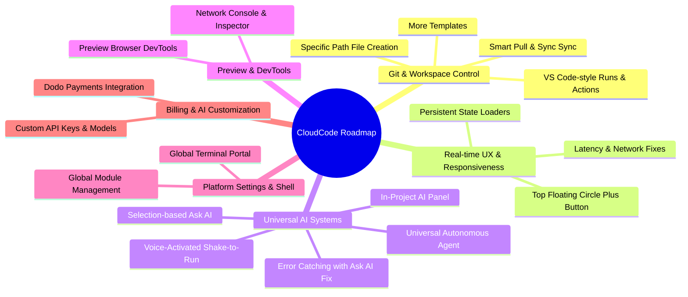

# 🚀 CloudCode Upcoming Features & Development Roadmap

This document outlines the planned upcoming features, user experience enhancements, AI integrations, and structural optimizations for **CloudCode**. These items are structured to take the mobile-first cloud IDE from a prototype to a premium, production-grade cloud development ecosystem.

---

## 🗺️ Feature Categories at a Glance



---

## 📂 1. Git & Workspace Core Operations

### 1.1. Robust Git Pull, Sync, and Merge Conflicts View
* **Current Gap:** Pushing from the mobile workspace fails silently if remote changes exist. There is no automated workflow to handle remote changes or display a visual diff.
* **Feature Description:**
  - Prevent Git push operations if the remote branch has commits that do not exist locally.
  - Automatically suggest/perform a `git pull` or `git fetch`.
  - Provide a visual diff view (like VS Code/GitKraken desktop) showing incoming changes versus local modifications.
  - Offer basic conflict resolution options directly in the mobile UI.

### 1.2. Directory-Specific File/Folder Creation
* **Current Gap:** Creation of files/folders is limited to root or lacks path selection.
* **Feature Description:**
  - Update the file manager sidebar to allow right-click/long-press contexts at any subfolder path to trigger "New File" or "New Folder" at that precise route.
  - Add an input path validation step to prevent invalid directory paths.

### 1.3. Additional Project & Environment Templates
* **Current Gap:** Limited to a few templates (Node, React, Empty).
* **Feature Description:**
  - Build a richer templates library in `new-project.tsx`.
  - Add templates for popular ecosystems:
    - **Python:** Flask, FastAPI, Django
    - **Rust:** Cargo basic, Axum
    - **Go:** Gin, Fiber
    - **Next.js:** Full-stack app router skeleton
    - **Mobile/Web:** Tailwind presets, Expo templates

### 1.4. Advanced Running & Editing Abilities
* **Current Gap:** Editing is plain text, and running requires manual terminal commands.
* **Feature Description:**
  - Add a persistent "Run Project" button at the top header that auto-detects standard dev scripts (`npm run dev`, `python main.py`, etc.) and boots them.
  - Implement basic editor capabilities: code folding, symbol search, search & replace across files, and formatting with Prettier/ESLint.

---

## 📱 2. UI/UX & Real-time State Indicators

### 2.1. Real-time Loading Indicators & State Persistence
* **Current Gap:** Screens go idle during network latency without visual loaders. Reconnect scripts get stuck on "connecting loader" without auto-reboot or refresh feedback. The Git commit changes count doesn't increment/decrement unless a full page reload occurs.
* **Feature Description:**
  - Implement full visual skeleton screens and spinner overlays for any operation taking $>150\text{ms}$.
  - **Git Upstream/Downstream Indicators:** Maintain a local state cache that increments/decrements the changes badge immediately upon staging/committing/syncing.
  - **Terminal Autorecover:** If the websocket disconnects or gets stuck in `connecting` state for more than `3` seconds, show a fallback "Reconnecting..." status bar and trigger a soft reconnect backoff rather than locking the UI.

### 2.2. Ergonomic Action Button Placement
* **Current Gap:** Creating folder/project buttons are placed out of immediate reach.
* **Feature Description:**
  - Reposition the primary `+` creation button as a central circular floating action button (FAB) integrated into the top navigation header or floating navigation bar.
  - Make it visually premium with subtle glowing rings, glassmorphic backgrounds, and expand-on-tap micro-animations.

### 2.3. Network Latency & Response Optimization
* **Current Gap:** Delayed responses on Git states, file saves, and shell interactions.
* **Feature Description:**
  - Optimistic UI updates on mobile (updating UI state immediately and reverting only if the server API fails).
  - Use Gzip/Brotli compression for file tree schemas and cache unchanged project structures locally using SQLite/AsyncStorage.

---

## 🤖 3. Universal & Integrated AI Systems

### 3.1. Universal Autonomous AI Agent
* **Current Gap:** Chat is localized to single workspaces.
* **Feature Description:**
  - Introduce a Global AI Agent available at the top root of the app.
  - The agent works autonomously: if a user prompts *"Create a Next.js setup with Tailwind called my-portfolio"*, the agent makes API requests to spin up the workspace, pull the templates, run the installation commands, and open the editor automatically.

### 3.2. Selection-based "Ask AI" Context Menu
* **Current Gap:** Users have to manually copy-paste code snippets into the AI assistant tab.
* **Feature Description:**
  - When text is highlighted inside the code editor, trigger a native floating toolbar containing an **"Ask AI"** action button.
  - Tapping this button opens the AI screen instantly, pre-populating the prompt input with the selected code block as context.

### 3.3. In-Project Dockable AI Panel
* **Current Gap:** Navigating away from the editor to ask questions breaks the workspace flow.
* **Feature Description:**
  - Integrate a slide-out drawer or overlay AI panel inside the project workspace itself.
  - Allows concurrent code viewing and AI assistance without leaving `editor.tsx`.

### 3.4. Preview Error Overlay with Auto-Fix Agent
* **Current Gap:** App crashes or runtime console errors inside the web preview are hidden or require desktop browser inspectors.
* **Feature Description:**
  - Intercept uncaught iframe/webview exceptions and render a clean, developer-friendly error banner on top of the preview.
  - Add an **"Ask AI to Fix"** button right next to the error traceback. Tapping it sends the error logs and current code file to the AI to generate a proposed bug-fix diff.

### 3.5. Voice-Controlled Autonomous Shake-to-Act
* **Current Gap:** Interaction is touch-centric.
* **Feature Description (Advanced):**
  - Implement a mobile-first gesture listener: shaking the device opens a futuristic full-screen voice overlay.
  - Utilizes text-to-speech and speech-to-text to run commands autonomously: e.g., *"Commit current changes and push them"* or *"Run npm install tailwind"* handles the entire task using backend execution pipelines.

---

## 🔍 4. Web Preview & DevTools

### 4.1. In-App Mobile Developer Tools
* **Current Gap:** Web previews are blind viewports.
* **Feature Description:**
  - Place a 3-dot browser menu in the preview header.
  - Expand to show a miniature DevTools panel:
    - **Console Log Viewer:** Displays javascript logs forwarded from the preview.
    - **Network Traffic Monitor:** Tracks asset loading times and status codes.
    - **DOM Inspector:** A simplified outline tree of the rendered DOM.

---

## ⚙️ 5. Global Shell & Module Management

### 5.1. Global Terminal Portal
* **Current Gap:** Terminals are strictly tied to specific project containers.
* **Feature Description:**
  - Add a dedicated Global Terminal in the settings or dashboard tab for quick utility operations, global environment checks, or system status monitoring.

### 5.2. Personal PC Experience & Settings Dashboard
* **Current Gap:** Users have no clear visibility of what tools/runtimes are installed inside their containers.
* **Feature Description:**
  - Provide a dashboard showing installed compilers and global dependencies (Node.js version, Python version, Git version, Docker container metrics).
  - Give users the ability to manually install/upgrade global workspace modules directly from an intuitive settings list, reinforcing the feel of having a complete native PC inside their mobile device.

---

## 💳 6. Billing, Custom Keys, & Models

### 6.1. Flexible AI Key & Provider Management
* **Current Gap:** Static server-managed LLM prompts.
* **Feature Description:**
  - Allow users to supply their own API keys (Gemini, OpenAI, Anthropic) in settings.
  - Add choices to toggle between default models. 
  - *DigitalOcean Deployment Suggestion:* See the discussion below for hosted AI endpoints.

### 6.2. Multi-tier Subscription Plans with Payment Gateways
* **Current Gap:** No paywall or monetization mechanisms.
* **Feature Description:**
  - Integrate Free, Pro, and Advanced plan tiers mapping container resource allocation directly to active hours and workspace storage limits.
  - **Aggressive Free Tier Management:** Enforce a strict **5-minute idle container timeout** for free users. This aggressive auto-sleep frees up server RAM instantly and must be visually displayed in the mobile settings page so free users know their limits.
  - *Payment Provider Suggestion:* Implement **Dodo Payments** for payment handling. See evaluation below.

---

## 💬 Architectural Discussions & Strategic Recommendations

> [!NOTE]
> Below are targeted analyses for payment gateways, hosted LLM infrastructure, and mobile voice features.

### 💳 Evaluation: Dodo Payments Integration
Dodo Payments is a Merchant of Record (MoR) built for developers. It simplifies global billing, localized sales tax (VAT, GST), and subscription logic.

* **Pros for CloudCode:**
  - Handles global tax compliance (crucial for SaaS tools running in various countries).
  - Out-of-the-box support for subscription billing cycles and webhook notifications for provisioning/deprovisioning Pro/Adv limits.
  - Simpler API integration compared to vanilla Stripe, especially for cross-border transactions.
* **Recommendation:** **Highly Approved.** Proceed with Dodo Payments. Store the customer billing identifier in the Supabase `users` profile and listen to subscription state webhooks to dynamically configure the idle sleep timers (`10 mins` vs `2 hours` vs `6 hours`).

---

### ☁️ Discussion: DigitalOcean Hosted LLMs (Custom Models)
To supply default models without hitting scaling bottlenecks, we can utilize **DigitalOcean GPU Droplets** or **DigitalOcean Managed OpenSearch & AI models** (if utilizing their cloud catalog), or configure a VPS instance running **Ollama** or **vLLM** for open-weight models (like Llama-3 or Mistral).

* **Architecture for Hosted Models:**
  ```mermaid
  graph LR
    Client[Mobile App] -->|Prompt Request| NextJS[Next.js Backend API]
    NextJS -->|Proxy / Rate Limit Check| LLM_VPS[GPU Droplet / Ollama Server]
    LLM_VPS -->|Generate Stream| NextJS
    NextJS -->|Stream Response| Client
  ```
* **Pros:** Complete control over costs, data privacy, and prompt formatting.
* **Cons:** High infrastructure maintenance and idle GPU billing rates.
* **Recommendation:**
  1. Default to **Gemini API** for high-speed, cost-effective processing using your own developer tokens.
  2. Implement an option for users to toggle to **Custom LLM Endpoint** in the mobile app where they can input an OpenAI-compatible base URL and API key.

---

### 🗣️ Discussion: Voice-Controlled Autonomous Agent (Shake-to-Act)
Implementing voice recognition requires a reliable STT (Speech-to-Text) module on mobile and a robust task executor.

* **Recommended Flow:**
  - Use `expo-sensors` to hook into the accelerometer. When acceleration exceeds a defined threshold (shake gesture), open a full-screen overlays modal.
  - Utilize **Expo Speech / Expo Audio** or **whisper.js** for high-quality audio capture.
  - Forward captured text to the backend LLM. Instruct the model to parse the request into a list of structured JSON commands (e.g., `{ "action": "git_commit", "params": { "message": "voice update" } }`).
  - The Next.js server maps these JSON commands directly to backend scripts (Docker execs, file manipulation APIs, Git sync routes) and updates the frontend via WebSockets.
