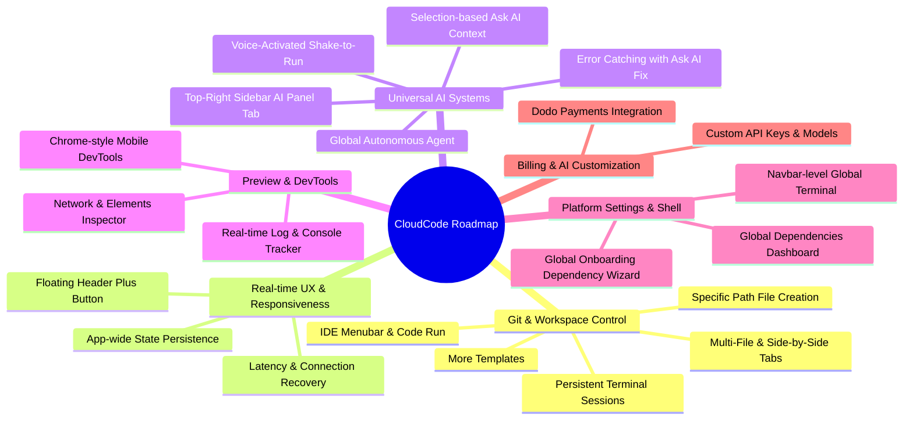

# 🚀 CloudCode Upcoming Features & Development Roadmap

This document outlines the planned upcoming features, user experience enhancements, AI integrations, and structural optimizations for **CloudCode**. These items are structured to take the mobile-first cloud IDE from a prototype to a premium, production-grade cloud development ecosystem.

---

## 🗺️ Feature Categories at a Glance



---

## 📂 1. Git & Workspace Core Operations

### 1.1. Robust Git Sync & Persistent Terminal Session
* **Current Gap:** Pushing from the mobile workspace fails silently if remote changes exist. Additionally, navigating away from the project view to workspaces or the dashboard kills or resets the active terminal tab, forcing users to start a new session and losing their environment state.
* **Feature Description:**
  - **Git Operations:** Prevent Git push operations if the remote branch has commits that do not exist locally, automatically suggesting a `git pull`/`git fetch` with visual conflict resolution tools.
  - **Persistent Terminal:** Maintain the terminal's socket connection and process state (utilizing backend `tmux` wrapping or in-memory shell process stream preservation). The session remains fully active when switching screens (e.g., going back to Workspaces/Dashboard and returning).
  - **Auto-Recovery Logs:** If the container or shell process terminates, all running processes halt, but the log history/interactions of that session are persisted and restored upon the terminal re-opening.

### 1.2. Directory-Specific File/Folder Creation & Multi-File Editor Tabs
* **Current Gap:** Creation of files/folders is limited to root or lacks path selection. The mobile editor is currently locked to a single file at a time, preventing developers from switching quickly between multiple scripts or seeing files side-by-side.
* **Feature Description:**
  - **Directory Creation:** Update the file manager sidebar to allow context menus (right-click/long-press) at any subfolder path to trigger "New File" or "New Folder" at that precise route with path input validation.
  - **Multi-File Tab System:** Implement a tab bar at the top of the mobile code editor displaying all currently opened files with close (`x`) buttons. Users can switch between files with a single tap.
  - **Side-by-Side Mobile Editing:** Introduce a split-screen viewport layout optimized for mobile screens, enabling users to place two code files side-by-side or stacked vertically for quick reference and multitasking.

### 1.3. Additional Project & Environment Templates
* **Current Gap:** Limited to a few templates (Node, React, Empty).
* **Feature Description:**
  - Build a richer templates library in `new-project.tsx`.
  - Add templates for popular ecosystems:
    - **Python:** Flask, FastAPI, Django
    - **Rust:** Cargo basic, Axum
    - **Go:** Gin, Fiber
    - **Next.js:** Full-stack app router skeleton
    - **Mobile/Web:** Tailwind presets, Expo templates

### 1.4. Desktop-Style IDE Menubar & Custom File Runner
* **Current Gap:** Running code requires manual terminal configuration, and the editor lacks standard desktop IDE options.
* **Feature Description:**
  - **IDE Toolbar/Menubar:** Implement a mobile-optimized top menubar providing options typical of full IDEs (e.g., "File", "Edit", "Selection", "View", "Go").
  - **Smart Runner Menu:** Implement a contextual "Run" button simulating standard desktop runners (e.g., compile and execute a single `.c` file, execute a `.py` script, or start a `.js` workspace). 
  - **Debugging Controls:** Provide an execution control overlay with options: "Start Debugging", "Run Without Debugging", "Restart", and "Stop", forwarding signals directly to the container's interactive shell.

---

## 📱 2. UI/UX & Real-time State Indicators

### 2.1. App-Wide State Persistence & Loading Overlays
* **Current Gap:** Delayed responses or network latency result in jarring blank states, frozen components, or lost navigation cache across multiple screens (not just in Git or terminals).
* **Feature Description:**
  - **Unified Skeleton Loaders:** Implement custom loading states, progress bars, and visual skeletal placeholders across *all* app screens for any background actions taking $>150\text{ms}$.
  - **App-Wide State Caching:** Use global Zustand persistence (or SQLite/AsyncStorage backing) to cache the visual state of files, dashboard stats, Git counts, and project trees so that navigating away and back is seamless.
  - **Connection Recovery Bar:** Introduce a system-wide status bar that shows "Reconnecting..." whenever the WebSocket disconnects, triggering a soft background reconnect backoff without locking the application UI.

### 2.2. Ergonomic Action Button Placement
* **Current Gap:** Creating folder/project buttons are placed out of immediate reach.
* **Feature Description:**
  - Reposition the primary `+` creation button as a central circular floating action button (FAB) integrated into the top navigation header or floating navigation bar.
  - Make it visually premium with subtle glowing rings, glassmorphic backgrounds, and expand-on-tap micro-animations.

### 2.3. Network Latency & Response Optimization
* **Current Gap:** Delayed responses on Git states, file saves, and shell interactions.
* **Feature Description:**
  - Optimistic UI updates on mobile (updating UI state immediately and reverting only if the server API fails).
  - Use Gzip/Brotli compression for file tree schemas and cache unchanged project structures locally.

---

## 🤖 3. Universal & Integrated AI Systems

### 3.1. Unified Global Autonomous AI Agent
* **Current Gap:** Chat is localized to single workspaces, creating fragmented workflows and preventing developers from using AI to manage the overall container or environment.
* **Feature Description:**
  - Introduce a Global Autonomous AI Agent accessible at the root of the app, replacing localized single-workspace chat components.
  - **AI Everywhere Integration:** Embed context-aware AI helper hooks directly inside terminal panels (e.g., "Ask AI to fix command error") and within the workspace setup page (e.g., a "Build with AI" button that prompts the agent to autogenerate workspaces).
  - **Autonomous Setup Execution:** The agent can write configurations, install libraries, create directories, and run setups automatically based on high-level commands (e.g., *"Set up a Next.js landing page with Tailwind"*).

### 3.2. Selection-based "Ask AI" Context Menu
* **Current Gap:** Users have to manually copy-paste code snippets into the AI assistant tab.
* **Feature Description:**
  - When text is highlighted inside the code editor, trigger a native floating toolbar containing an **"Ask AI"** action button.
  - Tapping this button opens the AI screen instantly, pre-populating the prompt input with the selected code block as context.

### 3.3. Right-Docked AI Panel Tab
* **Current Gap:** Opening the AI panel inside a project covers the editor or opens a disjointed slide-out drawer, breaking the flow of active development.
* **Feature Description:**
  - Introduce a dedicated AI Assistant tab on the top-right of the workspace dashboard layout, mirroring the file manager tab on the left.
  - Clicking this tab opens a collapsible sidebar/panel displaying the global AI chat directly next to the editor, leaving the top navigation tabs in place so developers can view code and interact with the AI concurrently.

### 3.4. Preview Error Overlay with Auto-Fix Agent
* **Current Gap:** App crashes or runtime console errors inside the web preview are hidden or require desktop browser inspectors.
* **Feature Description:**
  - Intercept uncaught iframe/webview exceptions and render a clean, developer-friendly error banner on top of the preview.
  - Add an **"Ask AI to Fix"** button right next to the error traceback. Tapping it sends the error logs and current code file to the AI to generate a proposed bug-fix diff.

### 3.5. Voice-Controlled Autonomous Shake-to-Act
* **Current Gap:** Interaction is touch-centric.
* **Feature Description (Advanced):**
  - Implement a mobile-first gesture listener: shaking the device opens a futuristic full-screen voice overlay.
  - Utilizes text-to-speech and speech-to-text to run commands autonomously: e.g., *"Commit current changes and push them"* or *"Run npm install tailwind"* handles the entire task using backend execution pipelines.

---

## 🔍 4. Web Preview & DevTools

### 4.1. Desktop-Grade Mobile Developer Tools
* **Current Gap:** Web previews are blind viewports lacking debug monitors and inspection capabilities.
* **Feature Description:**
  - Clicking the 3-dot preview menu opens a comprehensive in-app DevTools panel, mirroring Chrome DevTools and desktop editor panels.
  - **DevTools Tabs & Capabilities:**
    - **Console Log / Error Viewer:** Real-time log stream showing javascript warnings, errors, compile exceptions, and custom print statements.
    - **Network Traffic Monitor:** Real-time network request list showing assets loading, response/request headers, status codes, and latency payload details.
    - **DOM / Elements Inspector:** Visual outline tree representation of the rendered HTML DOM for layout inspection.
    - **Sources Inspector:** Displays files currently loaded by the browser environment for debugger tracing.

---

## ⚙️ 5. Global Shell & Module Management

### 5.1. Main Navbar Global Terminal
* **Current Gap:** Terminals are strictly tied to specific project containers or hidden inside Settings, preventing quick global administrative tasks.
* **Feature Description:**
  - Add a dedicated **Global Terminal** tab directly inside the main navigation bar/tab layout (positioned alongside Workspaces, Global AI, and Dashboard).
  - Allows quick global command execution, environment monitoring, and multi-container actions without opening specific project workspaces.

### 5.2. Onboarding Tool Wizard & Installed PC Runtimes Dashboard
* **Current Gap:** Users have no clear visibility of what compiler tools or runtimes (Node.js, GCC, Python, etc.) are pre-installed inside container systems, nor can they manage global environments interactively.
* **Feature Description:**
  - **Onboarding Dependency Wizard:** Upon first-time user onboarding, present a clear confirmation screen. Prompt the user: *"We are installing essential development runtimes (Node.js, Git, GCC, Python) as a pre-requisite. Would you like to proceed?"*
    - Options: **"Confirm Auto-Install (Recommended)"** or **"Install Manually"**.
    - Include an expandable panel at the bottom to search, check recommended tools, and selectively add other components before initialization.
  - **Global Dependencies Settings:** Add a dashboard in settings that acts like a desktop system application search (e.g., Windows Search). Displays all globally installed runtimes, compilers, and library modules with active version tags, enabling users to check what is installed and search/install updates globally.

---

## 💳 6. Billing, Custom Keys, & Models

### 6.1. Flexible AI Key & Provider Management
* **Current Gap:** Static server-managed LLM prompts.
* **Feature Description:**
  - Allow users to supply their own API keys (Gemini, OpenAI, Anthropic) in settings.
  - Add choices to toggle between default models. 
  - *DigitalOcean Deployment Suggestion:* See the discussion below for hosted AI endpoints.

### 6.2. Multi-tier Subscription Plans with Payment Gateways
* **Current Gap:** No paywall or monetization mechanisms.
* **Feature Description:**
  - Integrate Free, Pro, and Advanced plan tiers mapping container resource allocation directly to active hours and workspace storage limits.
  - **Aggressive Free Tier Management:** Enforce a strict **5-minute idle container timeout** for free users. This aggressive auto-sleep frees up server RAM instantly and must be visually displayed in the mobile settings page so free users know their limits.
  - *Payment Provider Suggestion:* Implement **Dodo Payments** for payment handling. See evaluation below.

---

## 💬 Architectural Discussions & Strategic Recommendations

> [!NOTE]
> Below are targeted analyses for payment gateways, hosted LLM infrastructure, and mobile voice features.

### 💳 Evaluation: Dodo Payments Integration
Dodo Payments is a Merchant of Record (MoR) built for developers. It simplifies global billing, localized sales tax (VAT, GST), and subscription logic.

* **Pros for CloudCode:**
  - Handles global tax compliance (crucial for SaaS tools running in various countries).
  - Out-of-the-box support for subscription billing cycles and webhook notifications for provisioning/deprovisioning Pro/Adv limits.
  - Simpler API integration compared to vanilla Stripe, especially for cross-border transactions.
* **Recommendation:** **Highly Approved.** Proceed with Dodo Payments. Store the customer billing identifier in the Supabase `users` profile and listen to subscription state webhooks to dynamically configure the idle sleep timers (`10 mins` vs `2 hours` vs `6 hours`).

---

### ☁️ Discussion: DigitalOcean Hosted LLMs (Custom Models)
To supply default models without hitting scaling bottlenecks, we can utilize **DigitalOcean GPU Droplets** or **DigitalOcean Managed OpenSearch & AI models** (if utilizing their cloud catalog), or configure a VPS instance running **Ollama** or **vLLM** for open-weight models (like Llama-3 or Mistral).

* **Architecture for Hosted Models:**
  ```mermaid
  graph LR
    Client[Mobile App] -->|Prompt Request| NextJS[Next.js Backend API]
    NextJS -->|Proxy / Rate Limit Check| LLM_VPS[GPU Droplet / Ollama Server]
    LLM_VPS -->|Generate Stream| NextJS
    NextJS -->|Stream Response| Client
  ```
* **Pros:** Complete control over costs, data privacy, and prompt formatting.
* **Cons:** High infrastructure maintenance and idle GPU billing rates.
* **Recommendation:**
  1. Default to **Gemini API** for high-speed, cost-effective processing using your own developer tokens.
  2. Implement an option for users to toggle to **Custom LLM Endpoint** in the mobile app where they can input an OpenAI-compatible base URL and API key.

---

### 🗣️ Discussion: Voice-Controlled Autonomous Agent (Shake-to-Act)
Implementing voice recognition requires a reliable STT (Speech-to-Text) module on mobile and a robust task executor.

* **Recommended Flow:**
  - Use `expo-sensors` to hook into the accelerometer. When acceleration exceeds a defined threshold (shake gesture), open a full-screen overlays modal.
  - Utilize **Expo Speech / Expo Audio** or **whisper.js** for high-quality audio capture.
  - Forward captured text to the backend LLM. Instruct the model to parse the request into a list of structured JSON commands (e.g., `{ "action": "git_commit", "params": { "message": "voice update" } }`).
  - The Next.js server maps these JSON commands directly to backend scripts (Docker execs, file manipulation APIs, Git sync routes) and updates the frontend via WebSockets.
